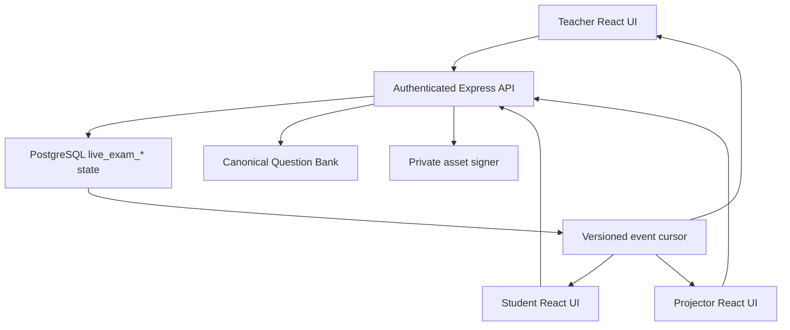
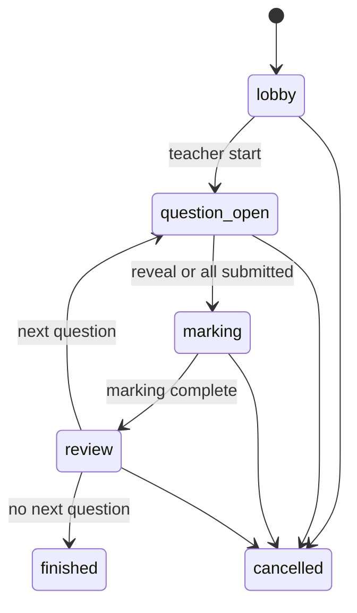

# CamPath Live Game / Live Challenge — yagona master specification

Status: `implemented_with_blockers`  
Audit sanasi: 2026-09-22  
Audit qilingan `origin/main`: `3507e59839fb509b2c644dee1cf5326389e48577`  
Repository: `sarvar9417/cambridge_online`  
Canonical hujjat: faqat shu fayl

Bu hujjat CamPath’dagi Live Game qismini boshidan qayta loyihalash uchun emas. U mavjud `live_exam_*` implementationni buzmasdan, qolgan xavf va yetishmovchiliklarni yopib, teacher–student–projector oqimini production-ready qilish uchun AI agentga yagona ish manbai bo‘ladi.

## 1. AI agent uchun qat’iy ish qoidalari

1. Avval ushbu hujjatni to‘liq o‘qing, keyin unda ko‘rsatilgan real kod fayllarini tekshiring.
2. `Live Game`, `Live Challenge` va koddagi `Live Exam` bitta mahsulot. Yangi parallel `live_challenge_*` jadval yoki ikkinchi state-machine yaratmang.
3. Canonical backend modeli `live_exam_*`, API prefix `/api/v1/live-exams`, frontend entry `LiveExamPage.tsx` bo‘lib qoladi. User-facing nom `Live Challenge`.
4. Mavjud Cambridge Question Bank savolini nusxalab yangi tahrirlanadigan corpus yaratmang. `question_id` canonical identity, session snapshot esa immutable assessment evidence.
5. Mark scheme savol ochiq paytda student payloadiga kirmasligi shart. Uni CSS bilan yashirish xavfsizlik emas.
6. Barcha state transition server va PostgreSQL transaction orqali bajariladi. Browser, timer yoki polling authoritative emas.
7. Applied migrationlarni o‘zgartirmang. Keyingi schema o‘zgarishi `0191_...sql` yoki repositoryda undan yangi migration paydo bo‘lsa, navbatdagi bo‘sh raqam bilan additive migration bo‘lishi kerak.
8. Browser `live_exam_*` jadvallariga Supabase Data API orqali bevosita kirmaydi. Express API authorization boundary saqlanadi.
9. P0 item yopilmasa `release.maturity`ni `production_ready`ga o‘zgartirmang.
10. Har bir gap yopilganda kod, migration, unit/integration/browser testi va acceptance evidence bir commit yoki aniq bog‘langan commitlar ketma-ketligida bo‘lsin.
11. Preview va production deployment eng oxirgi gate. Avval local/CI correctness, migration dry-run va deterministic E2E.
12. Secret, service-role key yoki database passwordni kod, log, test fixture yoki hujjatga yozmang.

## 2. Machine-readable holat

Quyidagi blok CI tomonidan tekshiriladi. P0 item faqat acceptance evidence bilan yopilganda ro‘yxatdan olinadi.

<!-- LIVE_GAME_STATE:JSON:START -->
```json
{
  "schema_version": 1,
  "document": "LIVE-GAME-MASTER-SPEC.md",
  "audit": {
    "date": "2026-09-22",
    "base_sha": "3507e59839fb509b2c644dee1cf5326389e48577",
    "scope": "backend, database migrations, frontend, realtime cursor, scoring, evidence, tests and release history"
  },
  "release": {
    "maturity": "implemented_with_blockers",
    "latest_migration": "0193_durable_rate_limits.sql",
    "canonical_model": "live_exam_*",
    "canonical_api": "/api/v1/live-exams",
    "user_facing_name": "Live Challenge"
  },
  "repository": {
    "markdown_files": [
      "LIVE-GAME-MASTER-SPEC.md"
    ],
    "prompt_format": ".txt"
  },
  "implemented": {
    "teacher_builder": true,
    "six_digit_lobby": true,
    "student_join_membership_guard": true,
    "server_authoritative_state": true,
    "question_and_mark_scheme_snapshots": true,
    "teacher_peer_self_marking": true,
    "anonymous_peer_derangement": true,
    "pause_resume": true,
    "projector_mode": true,
    "marks_first_leaderboard": true,
    "teacher_override_audit": true,
    "learning_evidence_and_mastery": true,
    "safe_event_cursor_and_snapshot_recovery": true,
    "offline_draft_resilience": true
  },
  "gaps": {
    "p0": [
      { "id": "LG-P0-01", "title": "Mid-session leave can strand ungraded answers" },
      { "id": "LG-P0-02", "title": "Mark-scheme level and manual rubric fidelity is incomplete" },
      { "id": "LG-P0-03", "title": "Cross-session answer integrity and score caps need database enforcement" },
      { "id": "LG-P0-04", "title": "Question deadline does not autonomously close the round" },
      { "id": "LG-P0-05", "title": "Trigger-function security must be re-pinned after migration 0190" },
      { "id": "LG-P0-06", "title": "Real-database multi-client automated acceptance suite is missing" }
    ],
    "p1": [
      { "id": "LG-P1-01", "title": "Join-code retry, expiry and rotation" },
      { "id": "LG-P1-02", "title": "Live endpoint rate limits and abuse controls" },
      { "id": "LG-P1-03", "title": "Idempotency and version checks on every teacher transition" },
      { "id": "LG-P1-05", "title": "Classroom-scale realtime and load evidence" },
      { "id": "LG-P1-06", "title": "Projector privacy and display-name policy" },
      { "id": "LG-P1-07", "title": "Builder draft, preview, reorder and advanced filters" },
      { "id": "LG-P1-08", "title": "Late-join and withdrawal fairness policy" },
      { "id": "LG-P1-09", "title": "Detailed reports and exports" },
      { "id": "LG-P1-10", "title": "Observability, retention and archive policy" },
      { "id": "LG-P1-11", "title": "Accessibility and responsive browser coverage" },
      { "id": "LG-P1-12", "title": "Peer-pair history and marking quality controls" }
    ],
    "p2": [
      { "id": "LG-P2-01", "title": "QR join link" },
      { "id": "LG-P2-02", "title": "Per-question timing profiles" },
      { "id": "LG-P2-03", "title": "Team and house modes" },
      { "id": "LG-P2-04", "title": "Teacher rehearsal and demo mode" },
      { "id": "LG-P2-05", "title": "Optional calibration and double marking" }
    ]
  },
  "acceptance": {
    "verify_command": "npm run verify",
    "local_audit_verify": {
      "date": "2026-09-22",
      "backend_tests": "920/920",
      "frontend_tests": "822/822",
      "inventory_tests": "116/116",
      "typecheck": "passed",
      "production_build": "passed"
    },
    "required_final_gates": [
      "all P0 acceptance tests",
      "full repository verify",
      "migration dry-run and advisors",
      "teacher plus at least three student browser E2E",
      "preview readiness and E2E",
      "production deploy health check and cleanup-verified smoke"
    ]
  }
}
```
<!-- LIVE_GAME_STATE:JSON:END -->

## 3. Hozirgi yakuniy baho

Live Challenge demo emas: asosiy end-to-end oqim ishlab turibdi va production’da oldin teacher/student API smoke’dan o‘tgan. Biroq hozirgi kodni “mukammal” yoki “yakuniy production-ready” deb bo‘lmaydi. Eng muhim sabablar — mid-round participant lifecycle, mark-scheme type fidelity, deadline authority, database cross-row integrity va real PostgreSQL/multi-browser avtomatlashtirilgan testlarning yetishmasligi.

| Qism | Holat | Qisqa xulosa |
|---|---|---|
| Teacher builder | Ishlaydi | Topic/subtopic, auto/manual questions, timing, marking, late join, auto close, override va leaderboard sozlanadi |
| Lobby/join | Ishlaydi | 6 xonali kod, authenticated enrolment guard, presence va removal bor |
| Question delivery | Ishlaydi | Canonical source, parent context, dependency work, diagram, structured content va LaTeX ko‘rsatiladi |
| Answering | Ishlaydi, hardening kerak | 700 ms autosave, submit lock va reconnect snapshot bor; offline retry yo‘q |
| Timer | Qisman | Server save/submitni deadline + 10 s grace bilan bloklaydi, ammo round o‘zi yopilmaydi |
| Mark scheme secrecy | Ishlaydi | `question_open` paytida API mark scheme qaytarmaydi |
| Marking | Asosiy rejimlar ishlaydi | Teacher/peer/self, point scoring, force-complete va override bor; LoR/manual fidelity to‘liq emas |
| Projector | Ishlaydi | Lobby/question/mark scheme/leaderboard/finish ko‘rinishlari bor |
| Realtime | Ishlaydi, polling | Safe event cursor + authoritative snapshot; WebSocket/SSE emas |
| Results/evidence | Ishlaydi | Per-round/overall marks, audit, LO/subtopic evidence va mastery update bor |
| Automated acceptance | Yetarli emas | Ko‘p contract/unit test bor, lekin real DB va multi-browser lifecycle suite yo‘q |

## 4. Haqiqiy arxitektura



Frontend har 1.5 soniyada snapshot so‘raydi. `frontend/src/lib/api.ts` 15 soniyalik recovery window ichida avval `events?afterVersion=...&limit=1` cursorini tekshiradi. Version o‘zgarmasa cached per-user snapshot qayta ishlatiladi; version o‘zgarsa yoki 15 soniya o‘tsa authoritative snapshot olinadi. Access token almashganda snapshot cache tozalanadi.

Bu transport “realtime-like polling”. Event payload studentga answer, mark scheme yoki identity bermaydi; faqat version/type/time metadata qaytaradi.

## 5. Real kod xaritasi

### Backend

| Fayl | Vazifa |
|---|---|
| `backend/src/services/live-exam-service.ts` | Session yaratish, eligibility, snapshots, join, state transitions, answer, marking, pause/resume, report |
| `backend/src/routes/live-exams.ts` | Zod validation va REST routes |
| `backend/src/services/live-exam-realtime-service.ts` | Authorization-safe event cursor |
| `backend/src/routes/live-exam-realtime.ts` | `GET /:id/events` |
| `backend/src/services/live-exam-round-summary-service.ts` | Marks-first round va overall standings |
| `backend/src/routes/live-exam-round-summary.ts` | Staff-only round summary route |
| `backend/src/lib/marking.ts` | `all_required`, `any_n_from_m`, `exact_match` scoring engine va manual boundaries |
| `backend/src/app.ts` | Authenticated `/api/v1/live-exams` router mounting |

### Frontend

| Fayl | Vazifa |
|---|---|
| `frontend/src/live/LiveExamPage.tsx` | Builder, lobby, teacher, student va projector screens |
| `frontend/src/live/LiveExamLeaderboard.tsx` | Round/overall standings va score distribution |
| `frontend/src/student/StudentLiveChallengeCard.tsx` | Student dashboard live card |
| `frontend/src/lib/api.ts` | Live types, secure cache, cursor/snapshot recovery |
| `frontend/src/live/live-exam.css` | Main responsive presentation |
| `frontend/src/live/live-exam-leaderboard.css` | Leaderboard/projector styling |
| `frontend/src/student/student-live-challenge.css` | Student dashboard card styling |

### Database migrations

| Migration | Real vazifa |
|---|---|
| `0166_live_exam_sessions.sql` | Core enums va 7 ta core table, RLS/revoke boundary |
| `0167_live_exam_fk_indexes.sql` | FK covering indexes |
| `0168_live_exam_peer_integrity.sql` | Peer self-marking DB guard |
| `0169_live_exam_override_audit.sql` | Append-only teacher override history |
| `0170_live_exam_learning_evidence.sql` | Finished session evidence va mastery trigger |
| `0172_unified_live_challenge_controls.sql` | Pause/resume va one-learner peer→self fallback |
| `0173_live_challenge_database_hardening.sql` | Missing indexes va trigger function search paths |
| `0190_live_challenge_subtopic_evidence_fallback.sql` | Current-LO mapping bo‘lmasa stable subtopic evidence fallback |
| `0191_live_challenge_integrity_and_deadline_hardening.sql` | Cross-session row integrity, score caps, event-version uniqueness va trigger repin |

## 6. Haqiqiy state-machine

Database enum:

- `lobby`
- `question_open`
- `marking`
- `review`
- `finished`
- `cancelled`

Pause alohida enum emas; `paused_at` va `pause_remaining_s` orqali orthogonal holat.



Pause faqat `question_open`, `marking`, `review`da mumkin. `resume` oldingi asosiy holatga qaytadi. `finished` va `cancelled` terminal.

Muhim: eski planlardagi `DRAFT`, `PUBLISHED`, `ANSWERS_LOCKED`, `PEER_MARKING`, `ROUND_RESULTS`, `PAUSED` alohida DB statuslari real implementationda yo‘q. Ularning semantikasi mavjud enum + timestamps + marking mode orqali ifodalanadi. Yangi AI ikkinchi state-machine yaratmasin.

## 7. Database modeli

### `live_exam_sessions`

Class, host, title, unique 6-digit code, status, marking mode, default question time, current index, start/lock/reveal/finish timestamps, pause state, monotonik version va settings JSON saqlaydi.

### `live_exam_questions`

Canonical `question_id`, order, marks, immutable `question_snapshot`, immutable `mark_scheme_snapshot`. Session yaratilganda source material freeze qilinadi; keyingi Question Bank tahriri davom etayotgan assessmentni o‘zgartirmaydi.

### `live_exam_participants`

Session/student unique membership, joined/presence/left timestamps. `last_seen_at` 15 soniyalik heartbeat orqali yangilanadi; 30 soniyadan kichik interval UI’da online hisoblanadi.

### `live_exam_answers`

Per session-question/participant answer, word count, submit timestamp, final score/feedback/source va moderation metadata.

### `live_exam_reviews`

Teacher/peer/self reviewer assignment, status, score, feedback va moderation metadata.

### `live_exam_review_points`

Snapshot mark-point IDs, matched va awarded marks. Point ID canonical tablega FK emas — bu ataylab immutable session evidence.

### `live_exam_events`

Every material state mutation uchun session version bilan event audit. Realtime cursor faqat safe metadata beradi.

### `live_exam_score_overrides`

Teacher moderationdan oldingi/keyingi score, feedback va source’ni append-only saqlaydi.

### `live_exam_learning_evidence`

Final answer score’ni canonical question, target syllabus LO yoki stable subtopic, confidence, mapping basis va teacher-overridden flag bilan saqlaydi. Session `finished`ga o‘tganda mastery yangilanadi.

### Mavjud xavfsizlik chegarasi

- Barcha live tables’da RLS enabled.
- `anon` va `authenticated` grantlari revoked.
- Frontend faqat authenticated Express API orqali ishlaydi.
- Authorization `owner.school_id`, teacher class ownership/`class_teachers`, student active participant va enrollment orqali tekshiriladi.
- Mark scheme faqat `marking`, `review`, `finished` holatlarida snapshot response’ga qo‘shiladi.

## 8. API contract

Base: `/api/v1/live-exams`. Barcha endpointlar global `requireAuth`dan keyin mount qilinadi.

| Method/path | Actor | Vazifa |
|---|---|---|
| `GET /` | authorised staff/student | Oxirgi 50 sessiya; student faqat qatnashgan sessiyalar |
| `POST /` | class-controlling owner/teacher | Session va immutable question/MS snapshots yaratish |
| `GET /eligible-questions` | class-controlling staff | Manual picker uchun eligible pool |
| `POST /join` | enrolled student | 6-digit code bilan lobby yoki allowed late join |
| `GET /:id` | controller yoki active participant | Per-actor authoritative snapshot |
| `POST /:id/heartbeat` | authorised actor | Presence/readiness signal |
| `POST /:id/start` | controller | Lobbydan birinchi savolga o‘tish |
| `POST /:id/pause` | controller | Timer va actionsni muzlatish; optional `expectedVersion` |
| `POST /:id/resume` | controller | Oldingi state’ni davom ettirish |
| `POST /:id/leave` | student | Hozir barcha state’larda active membershipni yopadi — P0 |
| `POST /:id/participants/:studentId/remove` | controller | Faqat lobbyda studentni chiqarish |
| `PUT /:id/answer` | student | Max 20,000 char autosave |
| `POST /:id/answer/submit` | student | Immutable submit |
| `POST /:id/reveal` | controller | Answers lock, missing answers close, reviews assign, MS reveal |
| `POST /:id/reviews/:reviewId/submit` | assigned reviewer/controller | Point selection/manual score va feedback |
| `PUT /:id/answers/:answerId/moderate` | controller | Teacher override + audit |
| `POST /:id/marking/complete` | controller | Review holatiga o‘tish; `force` pending reviewsni 0 qiladi |
| `POST /:id/next` | controller | Next question yoki finished |
| `POST /:id/cancel` | controller | Terminal cancel |
| `GET /:id/events` | authorised actor | Safe version cursor, max 100 events |
| `GET /:id/round-summary` | staff | Review/finished marks-first standings |

Sensitive GET responses `Cache-Control: private, no-store` qaytaradi.

## 9. Question eligibility va source fidelity

Sessionga savol tushishi uchun:

1. `questions.status='approved'`.
2. Marks musbat.
3. `canonical_mark_schemes.status='approved'`.
4. Class syllabusga direct LO, reviewed compatibility yoki kamida `0.95` confidence stable primary subtopic orqali mapping mavjud.
5. Topic/subtopic filter syllabus code + topic number + subtopic code orqali historical versions bilan moslanadi.
6. `includeDiagrams=false` bo‘lsa recursive parent ancestry’dagi diagram/image ham exclude qilinadi.
7. `excludeSeen=true` bo‘lsa class assignments va oldingi live sessionsdagi savollar olinmaydi.
8. Required dependencies recursive closure bilan qo‘shiladi, topological orderda oldinga qo‘yiladi.
9. Dependency cycle, missing target, unapproved question, no mark scheme yoki 60 dan katta expanded bundle fail closed.
10. Private source asset signed/renderable bo‘lmasa visual session yaratilmaydi.

`questionCount` selected roots soni; required dependencies qo‘shilganda real session question count kattalashishi mumkin. Settings’da requested va dependency counts saqlanadi.

## 10. Teacher workflow — mavjud holat

1. Class tanlaydi.
2. 9618 topic/subtopic tanlaydi.
3. Auto yoki manual source-ready savollar tanlaydi.
4. Count/order/time/marking/leaderboard/diagram/exclude-seen/late-join/auto-close/override settings beradi.
5. Session yaratadi va 6-digit code oladi.
6. Lobby roster, online state va removalni ko‘radi.
7. Kamida bitta participant bo‘lsa start qiladi.
8. Question, timer, submitted count va participant state’ni ko‘radi.
9. Pause/resume yoki answer lock + mark scheme reveal qiladi.
10. Teacher mode’da har answerni pointlar/manual score bilan baholaydi; peer/self mode’da progressni kuzatadi.
11. Pending markingni kutadi yoki explicit confirmation bilan force-complete qiladi.
12. Leaderboard, distribution va all answer scoresni ko‘radi.
13. Next question yoki finish qiladi.
14. Finished reportda class-wide question rows va score totalsni ko‘radi.

## 11. Student workflow — mavjud holat

1. Dashboard card yoki Live Challenge route’ga kiradi.
2. 6 xonali kod kiritadi.
3. Backend enrollment va joinable state’ni tekshiradi.
4. Lobbyda teacher startini kutadi.
5. Current canonical question, dependency work, assets va timer ko‘radi.
6. Answer 700 ms debounce bilan serverga autosave bo‘ladi.
7. Submitdan keyin server answerni immutable qiladi.
8. Marking bosqichida assigned anonymous peer/self answer va official MS ko‘radi.
9. Mark points yoki manual score va optional feedback yuboradi.
10. Review bosqichida o‘z answeri, score, feedback va MSni ko‘radi.
11. Finished holatda per-question own result reportni ko‘radi.

## 12. Marking va scoring

### Mavjud

- Teacher marking: hostga barcha answers assigned.
- Self marking: har student o‘z answerini oladi.
- Peer marking: SHA-256 seeded deterministic ordering + one-position rotation.
- 2+ active answerda self assignment taqiqlangan.
- 1 active answer peer mode’da explicit self fallback.
- `all_required`, `any_n_from_m`, `exact_match` shared `computeScore` orqali group cap va requires qoidalari bilan hisoblanadi.
- `manual_only`, `code_output`, `levels_of_response` UI’da manual numeric score talab qiladi.
- Teacher peer/self score’ni override qilishi mumkin, agar setting enabled bo‘lsa.
- Override append-only audit tablega yoziladi.
- Cambridge marks leaderboardning asosiy qiymati; optional speed faqat teng ball tie-break.

### Muhim kamchilik

`markScheme()` snapshot query hozir `points` va `groups`ni oladi, lekin `mark_scheme_levels`ni olmaydi. Shu sabab `levels_of_response` question eligible bo‘lsa student/teacher official level descriptorsiz faqat numeric score beradi. `manual_only` va ba’zi `code_output` scheme’larda ham official source guidance UI uchun yetarliligi capability gate bilan isbotlanmagan.

## 13. Realtime, reconnect va presence

### Mavjud

- Database session version authoritative.
- Every material transition `live_exam_events`ga yoziladi.
- Event cursor assessment payloadni bermaydi.
- Cursor failure bo‘lsa full snapshot fallback.
- 15 soniyada majburiy full recovery snapshot.
- Token o‘zgarsa per-user snapshot cache clear.
- Heartbeat 15 s; UI online threshold 30 s.
- Server time offset bilan countdown hisoblanadi.
- Pause current remaining secondsni DBga freeze qiladi.

### Cheklov

- Transport 1.5 s polling; WebSocket/SSE/Supabase Realtime emas.
- Presence event session versionni oshirmaydi; 15 s full refreshgacha roster stale bo‘lishi mumkin.
- Har failed autosave avtomatik retry qilinmaydi; user textni yana o‘zgartirmasa dirty state qolishi mumkin.
- Browser yopilishidan oldin pending debounce flush yoki local encrypted draft queue yo‘q.
- Multi-tab bir student uchun conflict policy yo‘q; last autosave wins.

## 14. Results, evidence va analytics

### Mavjud

- Round marks, average, distribution va standings.
- Overall cumulative standings.
- Teacher final report all students/all questions.
- Student final report only own rows.
- Score source `teacher|peer|self`.
- Teacher override history.
- Finished transitionda LO/subtopic evidence.
- Direct current LO afzal, keyin reviewed compatibility, oxirida high-confidence stable subtopic fallback.
- Bir question bir subtopicdagi bir nechta LOga map bo‘lsa subtopic mastery marks bir marta hisoblanadi.
- Ungraded answer yoki unmapped question bo‘lsa finish fail closed.

### Cheklov

- CSV/PDF export yo‘q.
- Common missed mark points va misconception analytics yo‘q.
- Teacher report totalining “class aggregate” semantikasi UI’da yetarli aniq emas.
- Session compare, class trend va reteach recommendation yo‘q.

## 15. Security va privacy audit

### Kuchli tomonlar

- Global authentication.
- Class control va enrollment authorization.
- Student snapshot teacher fieldsni olmaydi.
- Mark scheme reveal gate serverda.
- Sensitive GET no-store.
- Direct Data API access revoked.
- Review owner check.
- Peer self-marking DB trigger.
- Override audit trigger.
- Safe event cursor.
- Signed asset URLs snapshotga doimiy yozilmaydi.

### Yopilishi kerak bo‘lgan joylar

- Live routes’da join/create/mutation-specific rate limit yo‘q.
- Join-code collision faqat 409 qaytaradi; server retry qilmaydi.
- Code session tugagandan keyin ham permanent unique bo‘lib qoladi; code-space vaqt o‘tishi bilan to‘ladi.
- `live_exam_answers` question va participant bir sessionga tegishli ekanini DB composite constraint/trigger bilan tekshirmaydi.
- Final/review scores DB darajasida question marks’dan oshmasligi to‘liq enforced emas; service tekshiradi, lekin future writer xato qilishi mumkin.
- `0190` `persist_live_exam_learning_evidence()`ni `CREATE OR REPLACE` qiladi. `0173`dagi pinned search path remote DBda saqlanib qolganini assumption qilmaslik kerak; yangi migration bilan explicit repin va catalog assertion shart.
- Projector leaderboard full student names ko‘rsatadi; school privacy policy va display-name setting yo‘q.
- Projector teacher tokeni bilan ochiladi va staff summary payload oladi; dedicated minimal projector token/view yo‘q.

## 16. P0 blockerlar va aniq acceptance criteria

### LG-P0-01 — Mid-session leave

Hozir `leave()` statusni tekshirmaydi. Student `question_open`dan keyin leave qilsa answer row qoladi, reveal faqat active participantsga review yaratadi, finished evidence trigger esa barcha answersdan final score talab qiladi. Natija: session finish bloklanishi mumkin.

Minimal xavfsiz yechim:

- Voluntary leave faqat `lobby`da ruxsat.
- Question boshlangandan keyin navigation/connection loss faqat presencega ta’sir qilsin, participant active qoladi.
- Future “withdraw” kerak bo‘lsa alohida explicit policy: answer/review reassignment, zero/absent score, analytics exclusion va audit event.

Acceptance:

- API mid-round leave uchun 409 qaytaradi.
- Disconnect/reconnect same participant va draftni tiklaydi.
- Lobby leave/rejoin ishlaydi.
- Peer reviewer disconnect qilsa assignment yo‘qolmaydi; teacher force-complete mumkin.
- Session barcha cases’da finish bo‘ladi va ungraded evidence qolmaydi.

### LG-P0-02 — Mark-scheme fidelity

Yechim:

- Snapshotga `mark_scheme_levels` order, band, min/max marks, descriptor va source fieldsni qo‘shish.
- Frontend type va `MarkSchemeView` levelsni official tartibda render qilsin.
- Teacher/self/peer manual band tanlash UX’i numeric inputdan kuchliroq bo‘lsin.
- Har scheme type uchun `live_capability` aniqlansin.
- Full fidelity bo‘lmagan scheme types eligibilitydan fail closed qilinsin.

Acceptance:

- Har 6 `scheme_type` uchun fixture va UI test.
- Group caps, requires, exact match va levels band score integration test.
- Snapshot source editdan keyin ham o‘zgarmaydi.
- Student MSni open state’da hech qaysi endpointdan ola olmaydi.

### LG-P0-03 — Database row integrity va score caps

Yechim:

- Additive migration answer participant va session-question bir sessionga tegishli ekanini trigger yoki normalized session FK orqali enforce qilsin.
- Review target/session consistency current triggerda qoladi va regression test kuchayadi.
- `final_score`, `awarded_marks`, review point awarded marks respective max’dan oshmasin.
- `score_source`, `submitted_at`, moderation fields uchun valid combination constraints yozilsin.
- Event `(session_id, session_version)` unique bo‘lsin, agar existing data audit toza bo‘lsa.

Acceptance:

- Cross-session answer insert/update DB tomonidan rad etiladi.
- Negative va over-max score service bypass qilinganda ham rad etiladi.
- Migration old data preflight va transaction rollback bilan test qilinadi.
- Supabase advisors’da yangi critical security/performance warning yo‘q.

### LG-P0-04 — Authoritative deadline

Hozir deadline save/submitni serverda bloklaydi, lekin status `question_open` bo‘lib qoladi. Teacher reveal bosmaguncha MS ochilmaydi. UI 00:00 da textarea’ni yopadi, submit button esa remaining=0ni disable qilmaydi; backend yana 10 soniya grace beradi.

Yechim:

- Deadline policy bitta constant/DB rule bo‘lsin; UI va server bir xil grace semantikasini ko‘rsatsin.
- Expired question idempotent server transition bilan answersni lock va reviewsni prepare qilsin.
- Transition snapshot/heartbeat requestga bog‘langan lazy close yoki reliable scheduled worker orqali bo‘lishi mumkin, lekin student hech qachon MSni deadline oldin ocholmasin.
- System transition event actor nullable/system identity va audit payload bilan yozilsin.

Acceptance:

- Teacher browser yopiq bo‘lsa ham timed round yopiladi.
- Two concurrent expiry calls bitta reveal/review set yaratadi.
- Pause deadline’ni muzlatadi; resume correct remaining time bilan davom etadi.
- 00:00 UI/server behavior bir xil.

### LG-P0-05 — Trigger function security

Yechim:

- Keyingi migration barcha Live Challenge trigger functionsga `SET search_path = public, pg_temp`ni explicit qayta o‘rnatsin.
- `pg_proc.proconfig`, owner va execute privilege uchun migration test yoki SQL audit yozilsin.
- Keraksiz `PUBLIC` execute revoke qilinsin; trigger executionga ta’siri real DBda test qilinsin.
- Function body object names schema-qualified bo‘lishi ma’qul.

Acceptance:

- Remote/staging catalog query barcha target functions pinned ekanini ko‘rsatadi.
- `anon`/`authenticated` live tablesni bevosita o‘qiy/yoza olmaydi.
- Triggerlar normal application transactionida ishlaydi.

### LG-P0-06 — Automated acceptance suite

Yechim:

- Mock SQL-string testsni saqlang, lekin ular bilan cheklanmay real ephemeral PostgreSQLga barcha live migrationsni qo‘llang.
- Service integration tests real constraints, triggers, transaction races va evidence persistence’ni tekshirsin.
- Playwright yoki repositoryga mos browser frameworkda 1 teacher + projector + kamida 3 student parallel contexts ishlatsin.

Majburiy E2E matrix:

- teacher/self/peer modes;
- one, two va three+ learners;
- late join on/off;
- pause/resume;
- timed expiry;
- autosave/reconnect;
- one disconnected reviewer + force complete;
- diagram/LaTeX/structured content;
- dependencies;
- every scheme type;
- teacher override audit;
- finish evidence/mastery;
- unauthorized class/student attempts;
- cache isolation after account switch.

## 17. P1 work backlog

### LG-P1-01 — Join code lifecycle

- Unique conflictni transaction ichida bounded retry qiling.
- Active sessions uchungina code uniqueness strategy yoki `join_code_expires_at` joriy qiling.
- Finished/cancelled code qayta ishlatilishidan oldin retention window belgilang.
- QR-safe signed join URL P2 bilan mos bo‘lsin.

### LG-P1-02 — Abuse controls

- `/join` per-user + IP rate limit.
- Session create/eligible pool uchun staff limit.
- Autosave uchun sane throughput/backpressure.
- In-memory rate limiter serverless instances bo‘yicha global emasligini hisobga olib durable strategy tanlang.

### LG-P1-03 — Idempotency/concurrency

- Create va all teacher mutations uchun `Idempotency-Key` yoki required `expectedVersion`.
- Conflict response authoritative current version/state bersin.
- Double-click va retry tests.

### LG-P1-04 — Offline answer resilience

- Versioned local draft per user/session/question.
- Retry with exponential backoff + online event.
- Flush on visibility/pagehide where safe.
- Cross-tab coordination; silent last-write-wins o‘rniga conflict notice.
- Submitdan keyin local draft delete.

### LG-P1-05 — Classroom scale

- 30, 60 va target maximum learners uchun load test.
- Cursor/snapshot QPS, DB pool, signed asset cache va p95 latency budget.
- Agar polling budgetdan oshsa SSE/WebSocket/Supabase Broadcastni notification-only qilib qo‘shing; DB baribir authoritative.

### LG-P1-06 — Projector privacy

- `displayNameMode`: full, first name, initials, anonymous alias.
- Projector uchun minimal response DTO/token yoki teacher-authorised read-only view.
- Student answer va internal IDs projector payloadiga kirmasligi contract test.

### LG-P1-07 — Builder completeness

- Draft/publish yoki clear “create immediately opens lobby” semantics.
- Selected questions preview, drag reorder, replace.
- Difficulty, total marks, source session/year/paper va diagram filters.
- Dependency-expanded count/marks oldindan ko‘rsatish.
- Pool pagination/search; hozir manual picker random 30 bilan cheklangan.

### LG-P1-08 — Late join fairness

- Late join studentga remaining time va score policy aniq ko‘rsatiladi.
- Marking/review paytida join taqiqlanganligi saqlanadi.
- Withdrawal/absence policy separate from network disconnect.

### LG-P1-09 — Reporting

- Per student, per question, per topic/subtopic.
- Most-missed mark points.
- CSV/PDF export.
- Class aggregate total/possible va average semanticasini ajrating.
- Reteach recommendation evidence-backed bo‘lsin.

### LG-P1-10 — Operations

- Structured logs: session, transition, latency, error code; answer text logga chiqmasin.
- Metrics: active rooms, cursor QPS, snapshot p95, autosave failures, force completes, deadline drift.
- Archive/retention/delete policy va school data isolation.
- Runbook: stuck marking, orphaned participant, migration failure, rollback.

### LG-P1-11 — Accessibility

- Keyboard-only builder, marking, modal/confirm alternative.
- Focus management after transitions.
- Screen-reader live regions without answer leakage.
- Contrast, reduced motion, mobile textarea, projector 1080p/4K.
- Automated axe + real browser viewport matrix.

### LG-P1-12 — Peer marking quality

- Recent pairing history to reduce repeat pairs.
- Optional double marking/calibration.
- Peer score disagreement threshold and teacher review queue.
- Feedback quality guard without forcing verbose text.

## 18. Tavsiya etilgan implementation ketma-ketligi

### Phase 0 — Baseline

1. Clean worktree va latest `origin/main`.
2. `npm ci`.
3. `npm run verify` baseline.
4. Existing production/staging migration ledgerni read-only tekshirish.
5. P0 testsni avval red holatda yozish.

### Phase 1 — Integrity migration va lifecycle

1. `0191_live_challenge_integrity_and_deadline_hardening.sql`ni qo‘llang.
2. Answer session-integrity, score cap, event version, function search-path guards.
3. `leave()`ni lobby-only qiling.
4. API error messages va tests.
5. Real PostgreSQL migration/integration tests.

### Phase 2 — Mark-scheme fidelity

1. Levels snapshot DTO.
2. Eligibility capability gate.
3. Backend scoring/validation.
4. Teacher/student/projector rubric UI.
5. Six scheme-type fixtures va E2E.

### Phase 3 — Deadline authority

1. Idempotent expiry transition.
2. One timer/grace contract.
3. Pause/resume race tests.
4. UI deadline and disabled state alignment.

### Phase 4 — Client resilience va concurrency

1. Idempotency/version coverage.
2. Autosave retry/local draft/cross-tab.
3. Join-code retry/expiry.
4. Rate limits.

### Phase 5 — Privacy, reporting va UX

1. Display-name/projector contract.
2. Builder preview/reorder/filter.
3. Detailed reports/export.
4. Accessibility.

### Phase 6 — Scale va release

1. Multi-client browser suite.
2. 30/60 learner load test.
3. Full `npm run verify`.
4. Supabase migration transaction dry-run, backup and advisors.
5. Staging/preview migration + E2E.
6. PR review va merge.
7. Production migration, deploy, readiness, smoke va exact fixture cleanup.

## 19. Test inventory — mavjud va yetishmaydigan

### Mavjud contract/unit tests

- Peer derangement/determinism/one-user fallback.
- Role boundary for join.
- Canonical mark scheme selection.
- Parent diagram exclusion.
- Missing asset fail-closed.
- Dependency topological order/cycle.
- Route validation/no-store.
- Event cursor authorization/safe metadata.
- Marks-first ranking/ties.
- Migration RLS/index/peer/override/evidence contracts.
- Source-fidelity rendering.
- Client cache account isolation va recovery window.
- Pause/resume controls presence.

### Muhim test bo‘shliqlari

- Create→join→start→submit→reveal→mark→next→finish service integration.
- Real trigger execution.
- Leave/disconnect lifecycle.
- Deadline expiry concurrency.
- Late join.
- Auto-close all submitted.
- Force marking with leaver/reviewer disconnect.
- All mark scheme types.
- Teacher override setting disabled/enabled.
- Exact snapshot role field assertions.
- Projector privacy.
- Load/pool exhaustion.
- Browser accessibility va mobile/projector visual regression.

## 20. Release evidence va ehtiyotkor talqin

Repository history’da quyidagi live milestones bor:

- Core real-time sessions: `74efb41` lineage.
- PostgreSQL question selection fixes: `d111faa`, `b2e1670` lineage.
- Marks-first leaderboard: `cdbe4c4`.
- Canonical mark schemes: `14a275c`.
- Unified classroom controls: `0f13dd39da03e960c67a425d714262f7a984e416`.
- 9618 product-consumption/subtopic fallback: `a248e445986a40259f12fee5edbcafc491b2b4b8`.

Ushbu audit branchida 2026-09-22 kuni to‘liq `npm run verify` o‘tdi: backend `920/920`, frontend `822/822`, inventory `116/116`, TypeScript typecheck va production build green. Vite bundle warning qaytardi: main JS taxminan `2.69 MB` (`752 KB` gzip); bu correctness failure emas, ammo Phase 6 performance budgetida yopilishi kerak.

Oldingi production evidence’da teacher/student API flow ham boshidan oxirigacha o‘tgan. U historical production evidence; yangi P0 fixlar va current release uchun yangi multi-browser E2E o‘rnini bosmaydi.

Preview environment’da `DATABASE_URL` readiness oldin yakuniy tasdiqlanmagan. User qaroriga ko‘ra preview to‘liq verification yakuniy release bosqichida qilinadi. Preview muvaffaqiyatli deb oldindan yozmang.

## 21. Definition of Done

Live Challenge faqat quyidagilarning hammasi bajarilganda “mukammal ishchi holat” deb belgilanadi:

- Machine state’da P0 ro‘yxat bo‘sh va har yopilish evidence bilan izohlangan.
- Migrations clean database va production-like snapshotda o‘tadi.
- RLS/revoke/function security catalog assertions o‘tadi.
- All scheme types source-faithful.
- Mid-round disconnect/leave sessionni strand qilmaydi.
- Deadline teacher browserisiz authoritative yopiladi.
- Three-role payload isolation isbotlangan.
- Teacher + projector + 3 students multi-browser E2E o‘tadi.
- 60 learner target load budget o‘tadi yoki product maximum aniq pasaytiriladi.
- Full `npm run verify` green.
- Preview readiness 200 va preview E2E green.
- Production migration/deploy health green.
- Production smoke fixturelari zero residue bilan tozalanadi.
- Error/fatal logs yangi release uchun tekshiriladi.
- Rollback/runbook va retention policy yozilgan.

## 22. AI handoff checklist

Har keyingi AI ish boshlashdan oldin:

- [ ] `git status`, branch, `origin/main`, latest migrationni tekshirdi.
- [ ] Shu hujjatdagi machine state va P0larni o‘qidi.
- [ ] Real service, route, migration, frontend va testsni ochdi.
- [ ] Applied migrationni tahrirlamadi.
- [ ] Yangi parallel Live Challenge model yaratmayapti.
- [ ] Mark scheme secrecy va snapshot immutabilityni saqlayapti.
- [ ] Student/staff payload isolationni test qilyapti.
- [ ] Changes uchun acceptance test avval yozildi.
- [ ] Full verify va migration evidence yig‘iladi.
- [ ] Preview/production faqat Phase 6da bajariladi.

Har AI ish tugatganda ushbu fayldagi machine state, gap status, implementation evidence va next exact stepni yangilashi shart. Hujjatdagi claim kod/test/migration evidence’dan kuchli emas.
