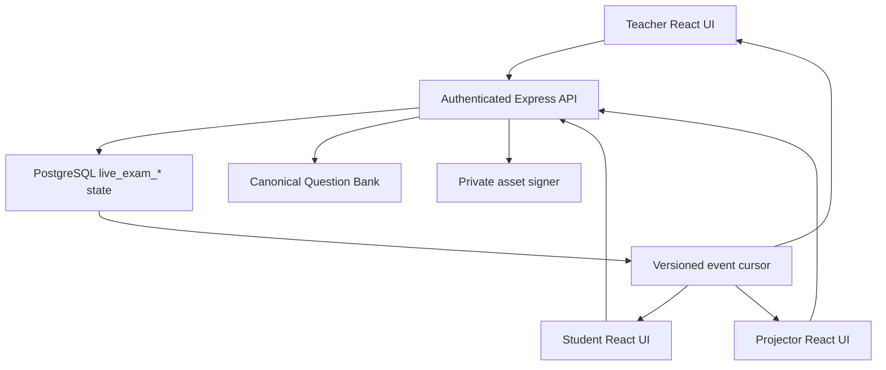
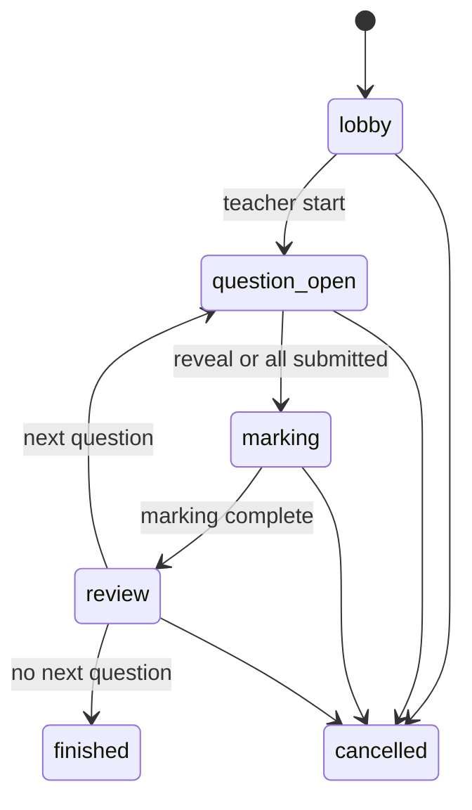

# CamPath Live Game / Live Challenge — yagona master specification

Status: `implemented_with_blockers`  
Audit sanasi: 2026-09-22  
Audit qilingan `origin/main`: `3507e59839fb509b2c644dee1cf5326389e48577`  
Repository: `sarvar9417/cambridge_online`  
Canonical hujjat: faqat shu fayl

**2026-09-23 yangilanishi:** Quyidagi 1–22-bo‘limlar Live Challenge uchun avvalgi spetsifikatsiya va tarixiy holatdir. Hujjat oxiridagi **Cambridge Project — Master Audit and Roadmap** joriyroq audit va butun platformaning yetkazib berish shartlarini beradi. Ikkalasida farq bo‘lsa, eng yangi kod, baza sxemasi va dalil bilan tekshiring; eskirgan gaplarni bajarilgan deb hisoblamang.

Bu hujjat CamPath’dagi Live Game qismini boshidan qayta loyihalash uchun emas. U mavjud `live_exam_*` implementationni buzmasdan, qolgan xavf va yetishmovchiliklarni yopib, teacher–student–projector oqimini production-ready qilish uchun AI agentga yagona ish manbai bo‘ladi.

## 1. AI agent uchun qat’iy ish qoidalari

1. Avval ushbu hujjatni to‘liq o‘qing, keyin unda ko‘rsatilgan real kod fayllarini tekshiring.
2. `Live Game`, `Live Challenge` va koddagi `Live Exam` bitta mahsulot. Yangi parallel `live_challenge_*` jadval yoki ikkinchi state-machine yaratmang.
3. Canonical backend modeli `live_exam_*`, API prefix `/api/v1/live-exams`, frontend entry `LiveExamPage.tsx` bo‘lib qoladi. User-facing nom `Live Challenge`.
4. Mavjud Cambridge Question Bank savolini nusxalab yangi tahrirlanadigan corpus yaratmang. `question_id` canonical identity, session snapshot esa immutable assessment evidence.
5. Mark scheme savol ochiq paytda student payloadiga kirmasligi shart. Uni CSS bilan yashirish xavfsizlik emas.
6. Barcha state transition server va PostgreSQL transaction orqali bajariladi. Browser, timer yoki polling authoritative emas.
7. Applied migrationlarni o‘zgartirmang. Keyingi schema o‘zgarishi `0191_...sql` yoki repositoryda undan yangi migration paydo bo‘lsa, navbatdagi bo‘sh raqam bilan additive migration bo‘lishi kerak.
8. Browser `live_exam_*` jadvallariga Supabase Data API orqali bevosita kirmaydi. Express API authorization boundary saqlanadi.
9. P0 item yopilmasa `release.maturity`ni `production_ready`ga o‘zgartirmang.
10. Har bir gap yopilganda kod, migration, unit/integration/browser testi va acceptance evidence bir commit yoki aniq bog‘langan commitlar ketma-ketligida bo‘lsin.
11. Preview va production deployment eng oxirgi gate. Avval local/CI correctness, migration dry-run va deterministic E2E.
12. Secret, service-role key yoki database passwordni kod, log, test fixture yoki hujjatga yozmang.

## 2. Machine-readable holat

Quyidagi blok CI tomonidan tekshiriladi. P0 item faqat acceptance evidence bilan yopilganda ro‘yxatdan olinadi.

<!-- LIVE_GAME_STATE:JSON:START -->
```json
{
  "schema_version": 1,
  "document": "LIVE-GAME-MASTER-SPEC.md",
  "audit": {
    "date": "2026-09-22",
    "base_sha": "3507e59839fb509b2c644dee1cf5326389e48577",
    "scope": "backend, database migrations, frontend, realtime cursor, scoring, evidence, tests and release history"
  },
  "release": {
    "maturity": "implemented_with_blockers",
    "latest_migration": "0223_9618_2021_mj21_remaining_visual_consumption.sql",
    "canonical_model": "live_exam_*",
    "canonical_api": "/api/v1/live-exams",
    "user_facing_name": "Live Challenge"
  },
  "repository": {
    "markdown_files": [
      "LIVE-GAME-MASTER-SPEC.md"
    ],
    "prompt_format": ".txt"
  },
  "implemented": {
    "teacher_builder": true,
    "six_digit_lobby": true,
    "student_join_membership_guard": true,
    "server_authoritative_state": true,
    "question_and_mark_scheme_snapshots": true,
    "teacher_peer_self_marking": true,
    "anonymous_peer_derangement": true,
    "pause_resume": true,
    "projector_mode": true,
    "marks_first_leaderboard": true,
    "teacher_override_audit": true,
    "learning_evidence_and_mastery": true,
    "safe_event_cursor_and_snapshot_recovery": true,
    "offline_draft_resilience": true
  },
  "gaps": {
    "p0": [
      { "id": "LG-P0-01", "title": "Mid-session leave can strand ungraded answers" },
      { "id": "LG-P0-02", "title": "Mark-scheme level and manual rubric fidelity is incomplete" },
      { "id": "LG-P0-03", "title": "Cross-session answer integrity and score caps need database enforcement" },
      { "id": "LG-P0-04", "title": "Question deadline does not autonomously close the round" },
      { "id": "LG-P0-05", "title": "Trigger-function security must be re-pinned after migration 0190" },
      { "id": "LG-P0-06", "title": "Real-database multi-client automated acceptance suite is missing" }
    ],
    "p1": [
      { "id": "LG-P1-01", "title": "Join-code retry, expiry and rotation" },
      { "id": "LG-P1-02", "title": "Live endpoint rate limits and abuse controls" },
      { "id": "LG-P1-03", "title": "Idempotency and version checks on every teacher transition" },
      { "id": "LG-P1-05", "title": "Classroom-scale realtime and load evidence" },
      { "id": "LG-P1-07", "title": "Builder draft, preview, reorder and advanced filters" },
      { "id": "LG-P1-08", "title": "Late-join and withdrawal fairness policy" },
      { "id": "LG-P1-09", "title": "Detailed reports and exports" },
      { "id": "LG-P1-10", "title": "Observability, retention and archive policy" },
      { "id": "LG-P1-11", "title": "Accessibility and responsive browser coverage" },
      { "id": "LG-P1-12", "title": "Peer-pair history and marking quality controls" }
    ],
    "p2": [
      { "id": "LG-P2-01", "title": "QR join link" },
      { "id": "LG-P2-02", "title": "Per-question timing profiles" },
      { "id": "LG-P2-03", "title": "Team and house modes" },
      { "id": "LG-P2-04", "title": "Teacher rehearsal and demo mode" },
      { "id": "LG-P2-05", "title": "Optional calibration and double marking" }
    ]
  },
  "acceptance": {
    "verify_command": "npm run verify",
    "local_audit_verify": {
      "date": "2026-09-22",
      "backend_tests": "920/920",
      "frontend_tests": "822/822",
      "inventory_tests": "116/116",
      "typecheck": "passed",
      "production_build": "passed"
    },
    "required_final_gates": [
      "all P0 acceptance tests",
      "full repository verify",
      "migration dry-run and advisors",
      "teacher plus at least three student browser E2E",
      "preview readiness and E2E",
      "production deploy health check and cleanup-verified smoke"
    ]
  }
}
```
<!-- LIVE_GAME_STATE:JSON:END -->

## 3. Hozirgi yakuniy baho

Live Challenge demo emas: asosiy end-to-end oqim ishlab turibdi va production’da oldin teacher/student API smoke’dan o‘tgan. Biroq hozirgi kodni “mukammal” yoki “yakuniy production-ready” deb bo‘lmaydi. Eng muhim sabablar — mid-round participant lifecycle, mark-scheme type fidelity, deadline authority, database cross-row integrity va real PostgreSQL/multi-browser avtomatlashtirilgan testlarning yetishmasligi.

| Qism | Holat | Qisqa xulosa |
|---|---|---|
| Teacher builder | Ishlaydi | Topic/subtopic, auto/manual questions, timing, marking, late join, auto close, override va leaderboard sozlanadi |
| Lobby/join | Ishlaydi | 6 xonali kod, authenticated enrolment guard, presence va removal bor |
| Question delivery | Ishlaydi | Canonical source, parent context, dependency work, diagram, structured content va LaTeX ko‘rsatiladi |
| Answering | Ishlaydi, hardening kerak | 700 ms autosave, submit lock va reconnect snapshot bor; offline retry yo‘q |
| Timer | Qisman | Server save/submitni deadline + 10 s grace bilan bloklaydi, ammo round o‘zi yopilmaydi |
| Mark scheme secrecy | Ishlaydi | `question_open` paytida API mark scheme qaytarmaydi |
| Marking | Asosiy rejimlar ishlaydi | Teacher/peer/self, point scoring, force-complete va override bor; LoR/manual fidelity to‘liq emas |
| Projector | Ishlaydi | Lobby/question/mark scheme/leaderboard/finish ko‘rinishlari bor |
| Realtime | Ishlaydi, polling | Safe event cursor + authoritative snapshot; WebSocket/SSE emas |
| Results/evidence | Ishlaydi | Per-round/overall marks, audit, LO/subtopic evidence va mastery update bor |
| Automated acceptance | Yetarli emas | Ko‘p contract/unit test bor, lekin real DB va multi-browser lifecycle suite yo‘q |

## 4. Haqiqiy arxitektura



Frontend har 1.5 soniyada snapshot so‘raydi. `frontend/src/lib/api.ts` 15 soniyalik recovery window ichida avval `events?afterVersion=...&limit=1` cursorini tekshiradi. Version o‘zgarmasa cached per-user snapshot qayta ishlatiladi; version o‘zgarsa yoki 15 soniya o‘tsa authoritative snapshot olinadi. Access token almashganda snapshot cache tozalanadi.

Bu transport “realtime-like polling”. Event payload studentga answer, mark scheme yoki identity bermaydi; faqat version/type/time metadata qaytaradi.

## 5. Real kod xaritasi

### Backend

| Fayl | Vazifa |
|---|---|
| `backend/src/services/live-exam-service.ts` | Session yaratish, eligibility, snapshots, join, state transitions, answer, marking, pause/resume, report |
| `backend/src/routes/live-exams.ts` | Zod validation va REST routes |
| `backend/src/services/live-exam-realtime-service.ts` | Authorization-safe event cursor |
| `backend/src/routes/live-exam-realtime.ts` | `GET /:id/events` |
| `backend/src/services/live-exam-round-summary-service.ts` | Marks-first round va overall standings |
| `backend/src/routes/live-exam-round-summary.ts` | Staff-only round summary route |
| `backend/src/lib/marking.ts` | `all_required`, `any_n_from_m`, `exact_match` scoring engine va manual boundaries |
| `backend/src/app.ts` | Authenticated `/api/v1/live-exams` router mounting |

### Frontend

| Fayl | Vazifa |
|---|---|
| `frontend/src/live/LiveExamPage.tsx` | Builder, lobby, teacher, student va projector screens |
| `frontend/src/live/LiveExamLeaderboard.tsx` | Round/overall standings va score distribution |
| `frontend/src/student/StudentLiveChallengeCard.tsx` | Student dashboard live card |
| `frontend/src/lib/api.ts` | Live types, secure cache, cursor/snapshot recovery |
| `frontend/src/live/live-exam.css` | Main responsive presentation |
| `frontend/src/live/live-exam-leaderboard.css` | Leaderboard/projector styling |
| `frontend/src/student/student-live-challenge.css` | Student dashboard card styling |

### Database migrations

| Migration | Real vazifa |
|---|---|
| `0166_live_exam_sessions.sql` | Core enums va 7 ta core table, RLS/revoke boundary |
| `0167_live_exam_fk_indexes.sql` | FK covering indexes |
| `0168_live_exam_peer_integrity.sql` | Peer self-marking DB guard |
| `0169_live_exam_override_audit.sql` | Append-only teacher override history |
| `0170_live_exam_learning_evidence.sql` | Finished session evidence va mastery trigger |
| `0172_unified_live_challenge_controls.sql` | Pause/resume va one-learner peer→self fallback |
| `0173_live_challenge_database_hardening.sql` | Missing indexes va trigger function search paths |
| `0190_live_challenge_subtopic_evidence_fallback.sql` | Current-LO mapping bo‘lmasa stable subtopic evidence fallback |
| `0191_live_challenge_integrity_and_deadline_hardening.sql` | Cross-session row integrity, score caps, event-version uniqueness va trigger repin |

## 6. Haqiqiy state-machine

Database enum:

- `lobby`
- `question_open`
- `marking`
- `review`
- `finished`
- `cancelled`

Pause alohida enum emas; `paused_at` va `pause_remaining_s` orqali orthogonal holat.



Pause faqat `question_open`, `marking`, `review`da mumkin. `resume` oldingi asosiy holatga qaytadi. `finished` va `cancelled` terminal.

Muhim: eski planlardagi `DRAFT`, `PUBLISHED`, `ANSWERS_LOCKED`, `PEER_MARKING`, `ROUND_RESULTS`, `PAUSED` alohida DB statuslari real implementationda yo‘q. Ularning semantikasi mavjud enum + timestamps + marking mode orqali ifodalanadi. Yangi AI ikkinchi state-machine yaratmasin.

## 7. Database modeli

### `live_exam_sessions`

Class, host, title, unique 6-digit code, status, marking mode, default question time, current index, start/lock/reveal/finish timestamps, pause state, monotonik version va settings JSON saqlaydi.

### `live_exam_questions`

Canonical `question_id`, order, marks, immutable `question_snapshot`, immutable `mark_scheme_snapshot`. Session yaratilganda source material freeze qilinadi; keyingi Question Bank tahriri davom etayotgan assessmentni o‘zgartirmaydi.

### `live_exam_participants`

Session/student unique membership, joined/presence/left timestamps. `last_seen_at` 15 soniyalik heartbeat orqali yangilanadi; 30 soniyadan kichik interval UI’da online hisoblanadi.

### `live_exam_answers`

Per session-question/participant answer, word count, submit timestamp, final score/feedback/source va moderation metadata.

### `live_exam_reviews`

Teacher/peer/self reviewer assignment, status, score, feedback va moderation metadata.

### `live_exam_review_points`

Snapshot mark-point IDs, matched va awarded marks. Point ID canonical tablega FK emas — bu ataylab immutable session evidence.

### `live_exam_events`

Every material state mutation uchun session version bilan event audit. Realtime cursor faqat safe metadata beradi.

### `live_exam_score_overrides`

Teacher moderationdan oldingi/keyingi score, feedback va source’ni append-only saqlaydi.

### `live_exam_learning_evidence`

Final answer score’ni canonical question, target syllabus LO yoki stable subtopic, confidence, mapping basis va teacher-overridden flag bilan saqlaydi. Session `finished`ga o‘tganda mastery yangilanadi.

### Mavjud xavfsizlik chegarasi

- Barcha live tables’da RLS enabled.
- `anon` va `authenticated` grantlari revoked.
- Frontend faqat authenticated Express API orqali ishlaydi.
- Authorization `owner.school_id`, teacher class ownership/`class_teachers`, student active participant va enrollment orqali tekshiriladi.
- Mark scheme faqat `marking`, `review`, `finished` holatlarida snapshot response’ga qo‘shiladi.

## 8. API contract

Base: `/api/v1/live-exams`. Barcha endpointlar global `requireAuth`dan keyin mount qilinadi.

| Method/path | Actor | Vazifa |
|---|---|---|
| `GET /` | authorised staff/student | Oxirgi 50 sessiya; student faqat qatnashgan sessiyalar |
| `POST /` | class-controlling owner/teacher | Session va immutable question/MS snapshots yaratish |
| `GET /eligible-questions` | class-controlling staff | Manual picker uchun eligible pool |
| `POST /join` | enrolled student | 6-digit code bilan lobby yoki allowed late join |
| `GET /:id` | controller yoki active participant | Per-actor authoritative snapshot |
| `POST /:id/heartbeat` | authorised actor | Presence/readiness signal |
| `POST /:id/start` | controller | Lobbydan birinchi savolga o‘tish |
| `POST /:id/pause` | controller | Timer va actionsni muzlatish; optional `expectedVersion` |
| `POST /:id/resume` | controller | Oldingi state’ni davom ettirish |
| `POST /:id/leave` | student | Hozir barcha state’larda active membershipni yopadi — P0 |
| `POST /:id/participants/:studentId/remove` | controller | Faqat lobbyda studentni chiqarish |
| `PUT /:id/answer` | student | Max 20,000 char autosave |
| `POST /:id/answer/submit` | student | Immutable submit |
| `POST /:id/reveal` | controller | Answers lock, missing answers close, reviews assign, MS reveal |
| `POST /:id/reviews/:reviewId/submit` | assigned reviewer/controller | Point selection/manual score va feedback |
| `PUT /:id/answers/:answerId/moderate` | controller | Teacher override + audit |
| `POST /:id/marking/complete` | controller | Review holatiga o‘tish; `force` pending reviewsni 0 qiladi |
| `POST /:id/next` | controller | Next question yoki finished |
| `POST /:id/cancel` | controller | Terminal cancel |
| `GET /:id/events` | authorised actor | Safe version cursor, max 100 events |
| `GET /:id/round-summary` | staff | Review/finished marks-first standings |

Sensitive GET responses `Cache-Control: private, no-store` qaytaradi.

## 9. Question eligibility va source fidelity

Sessionga savol tushishi uchun:

1. `questions.status='approved'`.
2. Marks musbat.
3. `canonical_mark_schemes.status='approved'`.
4. Class syllabusga direct LO, reviewed compatibility yoki kamida `0.95` confidence stable primary subtopic orqali mapping mavjud.
5. Topic/subtopic filter syllabus code + topic number + subtopic code orqali historical versions bilan moslanadi.
6. `includeDiagrams=false` bo‘lsa recursive parent ancestry’dagi diagram/image ham exclude qilinadi.
7. `excludeSeen=true` bo‘lsa class assignments va oldingi live sessionsdagi savollar olinmaydi.
8. Required dependencies recursive closure bilan qo‘shiladi, topological orderda oldinga qo‘yiladi.
9. Dependency cycle, missing target, unapproved question, no mark scheme yoki 60 dan katta expanded bundle fail closed.
10. Private source asset signed/renderable bo‘lmasa visual session yaratilmaydi.

`questionCount` selected roots soni; required dependencies qo‘shilganda real session question count kattalashishi mumkin. Settings’da requested va dependency counts saqlanadi.

## 10. Teacher workflow — mavjud holat

1. Class tanlaydi.
2. 9618 topic/subtopic tanlaydi.
3. Auto yoki manual source-ready savollar tanlaydi.
4. Count/order/time/marking/leaderboard/diagram/exclude-seen/late-join/auto-close/override settings beradi.
5. Session yaratadi va 6-digit code oladi.
6. Lobby roster, online state va removalni ko‘radi.
7. Kamida bitta participant bo‘lsa start qiladi.
8. Question, timer, submitted count va participant state’ni ko‘radi.
9. Pause/resume yoki answer lock + mark scheme reveal qiladi.
10. Teacher mode’da har answerni pointlar/manual score bilan baholaydi; peer/self mode’da progressni kuzatadi.
11. Pending markingni kutadi yoki explicit confirmation bilan force-complete qiladi.
12. Leaderboard, distribution va all answer scoresni ko‘radi.
13. Next question yoki finish qiladi.
14. Finished reportda class-wide question rows va score totalsni ko‘radi.

## 11. Student workflow — mavjud holat

1. Dashboard card yoki Live Challenge route’ga kiradi.
2. 6 xonali kod kiritadi.
3. Backend enrollment va joinable state’ni tekshiradi.
4. Lobbyda teacher startini kutadi.
5. Current canonical question, dependency work, assets va timer ko‘radi.
6. Answer 700 ms debounce bilan serverga autosave bo‘ladi.
7. Submitdan keyin server answerni immutable qiladi.
8. Marking bosqichida assigned anonymous peer/self answer va official MS ko‘radi.
9. Mark points yoki manual score va optional feedback yuboradi.
10. Review bosqichida o‘z answeri, score, feedback va MSni ko‘radi.
11. Finished holatda per-question own result reportni ko‘radi.

## 12. Marking va scoring

### Mavjud

- Teacher marking: hostga barcha answers assigned.
- Self marking: har student o‘z answerini oladi.
- Peer marking: SHA-256 seeded deterministic ordering + one-position rotation.
- 2+ active answerda self assignment taqiqlangan.
- 1 active answer peer mode’da explicit self fallback.
- `all_required`, `any_n_from_m`, `exact_match` shared `computeScore` orqali group cap va requires qoidalari bilan hisoblanadi.
- `manual_only`, `code_output`, `levels_of_response` UI’da manual numeric score talab qiladi.
- Teacher peer/self score’ni override qilishi mumkin, agar setting enabled bo‘lsa.
- Override append-only audit tablega yoziladi.
- Cambridge marks leaderboardning asosiy qiymati; optional speed faqat teng ball tie-break.

### Muhim kamchilik

`markScheme()` snapshot query hozir `points` va `groups`ni oladi, lekin `mark_scheme_levels`ni olmaydi. Shu sabab `levels_of_response` question eligible bo‘lsa student/teacher official level descriptorsiz faqat numeric score beradi. `manual_only` va ba’zi `code_output` scheme’larda ham official source guidance UI uchun yetarliligi capability gate bilan isbotlanmagan.

## 13. Realtime, reconnect va presence

### Mavjud

- Database session version authoritative.
- Every material transition `live_exam_events`ga yoziladi.
- Event cursor assessment payloadni bermaydi.
- Cursor failure bo‘lsa full snapshot fallback.
- 15 soniyada majburiy full recovery snapshot.
- Token o‘zgarsa per-user snapshot cache clear.
- Heartbeat 15 s; UI online threshold 30 s.
- Server time offset bilan countdown hisoblanadi.
- Pause current remaining secondsni DBga freeze qiladi.

### Cheklov

- Transport 1.5 s polling; WebSocket/SSE/Supabase Realtime emas.
- Presence event session versionni oshirmaydi; 15 s full refreshgacha roster stale bo‘lishi mumkin.
- Har failed autosave avtomatik retry qilinmaydi; user textni yana o‘zgartirmasa dirty state qolishi mumkin.
- Browser yopilishidan oldin pending debounce flush yoki local encrypted draft queue yo‘q.
- Multi-tab bir student uchun conflict policy yo‘q; last autosave wins.

## 14. Results, evidence va analytics

### Mavjud

- Round marks, average, distribution va standings.
- Overall cumulative standings.
- Teacher final report all students/all questions.
- Student final report only own rows.
- Score source `teacher|peer|self`.
- Teacher override history.
- Finished transitionda LO/subtopic evidence.
- Direct current LO afzal, keyin reviewed compatibility, oxirida high-confidence stable subtopic fallback.
- Bir question bir subtopicdagi bir nechta LOga map bo‘lsa subtopic mastery marks bir marta hisoblanadi.
- Ungraded answer yoki unmapped question bo‘lsa finish fail closed.

### Cheklov

- CSV/PDF export yo‘q.
- Common missed mark points va misconception analytics yo‘q.
- Teacher report totalining “class aggregate” semantikasi UI’da yetarli aniq emas.
- Session compare, class trend va reteach recommendation yo‘q.

## 15. Security va privacy audit

### Kuchli tomonlar

- Global authentication.
- Class control va enrollment authorization.
- Student snapshot teacher fieldsni olmaydi.
- Mark scheme reveal gate serverda.
- Sensitive GET no-store.
- Direct Data API access revoked.
- Review owner check.
- Peer self-marking DB trigger.
- Override audit trigger.
- Safe event cursor.
- Signed asset URLs snapshotga doimiy yozilmaydi.

### Yopilishi kerak bo‘lgan joylar

- Live routes’da join/create/mutation-specific rate limit yo‘q.
- Join-code collision faqat 409 qaytaradi; server retry qilmaydi.
- Code session tugagandan keyin ham permanent unique bo‘lib qoladi; code-space vaqt o‘tishi bilan to‘ladi.
- `live_exam_answers` question va participant bir sessionga tegishli ekanini DB composite constraint/trigger bilan tekshirmaydi.
- Final/review scores DB darajasida question marks’dan oshmasligi to‘liq enforced emas; service tekshiradi, lekin future writer xato qilishi mumkin.
- `0190` `persist_live_exam_learning_evidence()`ni `CREATE OR REPLACE` qiladi. `0173`dagi pinned search path remote DBda saqlanib qolganini assumption qilmaslik kerak; yangi migration bilan explicit repin va catalog assertion shart.
- Projector leaderboard full student names ko‘rsatadi; school privacy policy va display-name setting yo‘q.
- Projector teacher tokeni bilan ochiladi va staff summary payload oladi; dedicated minimal projector token/view yo‘q.

## 16. P0 blockerlar va aniq acceptance criteria

### LG-P0-01 — Mid-session leave

Hozir `leave()` statusni tekshirmaydi. Student `question_open`dan keyin leave qilsa answer row qoladi, reveal faqat active participantsga review yaratadi, finished evidence trigger esa barcha answersdan final score talab qiladi. Natija: session finish bloklanishi mumkin.

Minimal xavfsiz yechim:

- Voluntary leave faqat `lobby`da ruxsat.
- Question boshlangandan keyin navigation/connection loss faqat presencega ta’sir qilsin, participant active qoladi.
- Future “withdraw” kerak bo‘lsa alohida explicit policy: answer/review reassignment, zero/absent score, analytics exclusion va audit event.

Acceptance:

- API mid-round leave uchun 409 qaytaradi.
- Disconnect/reconnect same participant va draftni tiklaydi.
- Lobby leave/rejoin ishlaydi.
- Peer reviewer disconnect qilsa assignment yo‘qolmaydi; teacher force-complete mumkin.
- Session barcha cases’da finish bo‘ladi va ungraded evidence qolmaydi.

### LG-P0-02 — Mark-scheme fidelity

Yechim:

- Snapshotga `mark_scheme_levels` order, band, min/max marks, descriptor va source fieldsni qo‘shish.
- Frontend type va `MarkSchemeView` levelsni official tartibda render qilsin.
- Teacher/self/peer manual band tanlash UX’i numeric inputdan kuchliroq bo‘lsin.
- Har scheme type uchun `live_capability` aniqlansin.
- Full fidelity bo‘lmagan scheme types eligibilitydan fail closed qilinsin.

Acceptance:

- Har 6 `scheme_type` uchun fixture va UI test.
- Group caps, requires, exact match va levels band score integration test.
- Snapshot source editdan keyin ham o‘zgarmaydi.
- Student MSni open state’da hech qaysi endpointdan ola olmaydi.

### LG-P0-03 — Database row integrity va score caps

Yechim:

- Additive migration answer participant va session-question bir sessionga tegishli ekanini trigger yoki normalized session FK orqali enforce qilsin.
- Review target/session consistency current triggerda qoladi va regression test kuchayadi.
- `final_score`, `awarded_marks`, review point awarded marks respective max’dan oshmasin.
- `score_source`, `submitted_at`, moderation fields uchun valid combination constraints yozilsin.
- Event `(session_id, session_version)` unique bo‘lsin, agar existing data audit toza bo‘lsa.

Acceptance:

- Cross-session answer insert/update DB tomonidan rad etiladi.
- Negative va over-max score service bypass qilinganda ham rad etiladi.
- Migration old data preflight va transaction rollback bilan test qilinadi.
- Supabase advisors’da yangi critical security/performance warning yo‘q.

### LG-P0-04 — Authoritative deadline

Hozir deadline save/submitni serverda bloklaydi, lekin status `question_open` bo‘lib qoladi. Teacher reveal bosmaguncha MS ochilmaydi. UI 00:00 da textarea’ni yopadi, submit button esa remaining=0ni disable qilmaydi; backend yana 10 soniya grace beradi.

Yechim:

- Deadline policy bitta constant/DB rule bo‘lsin; UI va server bir xil grace semantikasini ko‘rsatsin.
- Expired question idempotent server transition bilan answersni lock va reviewsni prepare qilsin.
- Transition snapshot/heartbeat requestga bog‘langan lazy close yoki reliable scheduled worker orqali bo‘lishi mumkin, lekin student hech qachon MSni deadline oldin ocholmasin.
- System transition event actor nullable/system identity va audit payload bilan yozilsin.

Acceptance:

- Teacher browser yopiq bo‘lsa ham timed round yopiladi.
- Two concurrent expiry calls bitta reveal/review set yaratadi.
- Pause deadline’ni muzlatadi; resume correct remaining time bilan davom etadi.
- 00:00 UI/server behavior bir xil.

### LG-P0-05 — Trigger function security

Yechim:

- Keyingi migration barcha Live Challenge trigger functionsga `SET search_path = public, pg_temp`ni explicit qayta o‘rnatsin.
- `pg_proc.proconfig`, owner va execute privilege uchun migration test yoki SQL audit yozilsin.
- Keraksiz `PUBLIC` execute revoke qilinsin; trigger executionga ta’siri real DBda test qilinsin.
- Function body object names schema-qualified bo‘lishi ma’qul.

Acceptance:

- Remote/staging catalog query barcha target functions pinned ekanini ko‘rsatadi.
- `anon`/`authenticated` live tablesni bevosita o‘qiy/yoza olmaydi.
- Triggerlar normal application transactionida ishlaydi.

### LG-P0-06 — Automated acceptance suite

Yechim:

- Mock SQL-string testsni saqlang, lekin ular bilan cheklanmay real ephemeral PostgreSQLga barcha live migrationsni qo‘llang.
- Service integration tests real constraints, triggers, transaction races va evidence persistence’ni tekshirsin.
- Playwright yoki repositoryga mos browser frameworkda 1 teacher + projector + kamida 3 student parallel contexts ishlatsin.

Majburiy E2E matrix:

- teacher/self/peer modes;
- one, two va three+ learners;
- late join on/off;
- pause/resume;
- timed expiry;
- autosave/reconnect;
- one disconnected reviewer + force complete;
- diagram/LaTeX/structured content;
- dependencies;
- every scheme type;
- teacher override audit;
- finish evidence/mastery;
- unauthorized class/student attempts;
- cache isolation after account switch.

## 17. P1 work backlog

### LG-P1-01 — Join code lifecycle

- Unique conflictni transaction ichida bounded retry qiling.
- Active sessions uchungina code uniqueness strategy yoki `join_code_expires_at` joriy qiling.
- Finished/cancelled code qayta ishlatilishidan oldin retention window belgilang.
- QR-safe signed join URL P2 bilan mos bo‘lsin.

### LG-P1-02 — Abuse controls

- `/join` per-user + IP rate limit.
- Session create/eligible pool uchun staff limit.
- Autosave uchun sane throughput/backpressure.
- In-memory rate limiter serverless instances bo‘yicha global emasligini hisobga olib durable strategy tanlang.

### LG-P1-03 — Idempotency/concurrency

- Create va all teacher mutations uchun `Idempotency-Key` yoki required `expectedVersion`.
- Conflict response authoritative current version/state bersin.
- Double-click va retry tests.

### LG-P1-04 — Offline answer resilience

- Versioned local draft per user/session/question.
- Retry with exponential backoff + online event.
- Flush on visibility/pagehide where safe.
- Cross-tab coordination; silent last-write-wins o‘rniga conflict notice.
- Submitdan keyin local draft delete.

### LG-P1-05 — Classroom scale

- 30, 60 va target maximum learners uchun load test.
- Cursor/snapshot QPS, DB pool, signed asset cache va p95 latency budget.
- Agar polling budgetdan oshsa SSE/WebSocket/Supabase Broadcastni notification-only qilib qo‘shing; DB baribir authoritative.

### LG-P1-06 — Projector privacy

- `displayNameMode`: full, first name, initials, anonymous alias.
- Projector uchun minimal response DTO/token yoki teacher-authorised read-only view.
- Student answer va internal IDs projector payloadiga kirmasligi contract test.

### LG-P1-07 — Builder completeness

- Draft/publish yoki clear “create immediately opens lobby” semantics.
- Selected questions preview, drag reorder, replace.
- Difficulty, total marks, source session/year/paper va diagram filters.
- Dependency-expanded count/marks oldindan ko‘rsatish.
- Pool pagination/search; hozir manual picker random 30 bilan cheklangan.

### LG-P1-08 — Late join fairness

- Late join studentga remaining time va score policy aniq ko‘rsatiladi.
- Marking/review paytida join taqiqlanganligi saqlanadi.
- Withdrawal/absence policy separate from network disconnect.

### LG-P1-09 — Reporting

- Per student, per question, per topic/subtopic.
- Most-missed mark points.
- CSV/PDF export.
- Class aggregate total/possible va average semanticasini ajrating.
- Reteach recommendation evidence-backed bo‘lsin.

### LG-P1-10 — Operations

- Structured logs: session, transition, latency, error code; answer text logga chiqmasin.
- Metrics: active rooms, cursor QPS, snapshot p95, autosave failures, force completes, deadline drift.
- Archive/retention/delete policy va school data isolation.
- Runbook: stuck marking, orphaned participant, migration failure, rollback.

### LG-P1-11 — Accessibility

- Keyboard-only builder, marking, modal/confirm alternative.
- Focus management after transitions.
- Screen-reader live regions without answer leakage.
- Contrast, reduced motion, mobile textarea, projector 1080p/4K.
- Automated axe + real browser viewport matrix.

### LG-P1-12 — Peer marking quality

- Recent pairing history to reduce repeat pairs.
- Optional double marking/calibration.
- Peer score disagreement threshold and teacher review queue.
- Feedback quality guard without forcing verbose text.

## 18. Tavsiya etilgan implementation ketma-ketligi

### Phase 0 — Baseline

1. Clean worktree va latest `origin/main`.
2. `npm ci`.
3. `npm run verify` baseline.
4. Existing production/staging migration ledgerni read-only tekshirish.
5. P0 testsni avval red holatda yozish.

### Phase 1 — Integrity migration va lifecycle

1. `0191_live_challenge_integrity_and_deadline_hardening.sql`ni qo‘llang.
2. Answer session-integrity, score cap, event version, function search-path guards.
3. `leave()`ni lobby-only qiling.
4. API error messages va tests.
5. Real PostgreSQL migration/integration tests.

### Phase 2 — Mark-scheme fidelity

1. Levels snapshot DTO.
2. Eligibility capability gate.
3. Backend scoring/validation.
4. Teacher/student/projector rubric UI.
5. Six scheme-type fixtures va E2E.

### Phase 3 — Deadline authority

1. Idempotent expiry transition.
2. One timer/grace contract.
3. Pause/resume race tests.
4. UI deadline and disabled state alignment.

### Phase 4 — Client resilience va concurrency

1. Idempotency/version coverage.
2. Autosave retry/local draft/cross-tab.
3. Join-code retry/expiry.
4. Rate limits.

### Phase 5 — Privacy, reporting va UX

1. Display-name/projector contract.
2. Builder preview/reorder/filter.
3. Detailed reports/export.
4. Accessibility.

### Phase 6 — Scale va release

1. Multi-client browser suite.
2. 30/60 learner load test.
3. Full `npm run verify`.
4. Supabase migration transaction dry-run, backup and advisors.
5. Staging/preview migration + E2E.
6. PR review va merge.
7. Production migration, deploy, readiness, smoke va exact fixture cleanup.

## 19. Test inventory — mavjud va yetishmaydigan

### Mavjud contract/unit tests

- Peer derangement/determinism/one-user fallback.
- Role boundary for join.
- Canonical mark scheme selection.
- Parent diagram exclusion.
- Missing asset fail-closed.
- Dependency topological order/cycle.
- Route validation/no-store.
- Event cursor authorization/safe metadata.
- Marks-first ranking/ties.
- Migration RLS/index/peer/override/evidence contracts.
- Source-fidelity rendering.
- Client cache account isolation va recovery window.
- Pause/resume controls presence.

### Muhim test bo‘shliqlari

- Create→join→start→submit→reveal→mark→next→finish service integration.
- Real trigger execution.
- Leave/disconnect lifecycle.
- Deadline expiry concurrency.
- Late join.
- Auto-close all submitted.
- Force marking with leaver/reviewer disconnect.
- All mark scheme types.
- Teacher override setting disabled/enabled.
- Exact snapshot role field assertions.
- Projector privacy.
- Load/pool exhaustion.
- Browser accessibility va mobile/projector visual regression.

## 20. Release evidence va ehtiyotkor talqin

Repository history’da quyidagi live milestones bor:

- Core real-time sessions: `74efb41` lineage.
- PostgreSQL question selection fixes: `d111faa`, `b2e1670` lineage.
- Marks-first leaderboard: `cdbe4c4`.
- Canonical mark schemes: `14a275c`.
- Unified classroom controls: `0f13dd39da03e960c67a425d714262f7a984e416`.
- 9618 product-consumption/subtopic fallback: `a248e445986a40259f12fee5edbcafc491b2b4b8`.

Ushbu audit branchida 2026-09-22 kuni to‘liq `npm run verify` o‘tdi: backend `920/920`, frontend `822/822`, inventory `116/116`, TypeScript typecheck va production build green. Vite bundle warning qaytardi: main JS taxminan `2.69 MB` (`752 KB` gzip); bu correctness failure emas, ammo Phase 6 performance budgetida yopilishi kerak.

Oldingi production evidence’da teacher/student API flow ham boshidan oxirigacha o‘tgan. U historical production evidence; yangi P0 fixlar va current release uchun yangi multi-browser E2E o‘rnini bosmaydi.

Preview environment’da `DATABASE_URL` readiness oldin yakuniy tasdiqlanmagan. User qaroriga ko‘ra preview to‘liq verification yakuniy release bosqichida qilinadi. Preview muvaffaqiyatli deb oldindan yozmang.

## 21. Definition of Done

Live Challenge faqat quyidagilarning hammasi bajarilganda “mukammal ishchi holat” deb belgilanadi:

- Machine state’da P0 ro‘yxat bo‘sh va har yopilish evidence bilan izohlangan.
- Migrations clean database va production-like snapshotda o‘tadi.
- RLS/revoke/function security catalog assertions o‘tadi.
- All scheme types source-faithful.
- Mid-round disconnect/leave sessionni strand qilmaydi.
- Deadline teacher browserisiz authoritative yopiladi.
- Three-role payload isolation isbotlangan.
- Teacher + projector + 3 students multi-browser E2E o‘tadi.
- 60 learner target load budget o‘tadi yoki product maximum aniq pasaytiriladi.
- Full `npm run verify` green.
- Preview readiness 200 va preview E2E green.
- Production migration/deploy health green.
- Production smoke fixturelari zero residue bilan tozalanadi.
- Error/fatal logs yangi release uchun tekshiriladi.
- Rollback/runbook va retention policy yozilgan.

## 22. AI handoff checklist

Har keyingi AI ish boshlashdan oldin:

- [ ] `git status`, branch, `origin/main`, latest migrationni tekshirdi.
- [ ] Shu hujjatdagi machine state va P0larni o‘qidi.
- [ ] Real service, route, migration, frontend va testsni ochdi.
- [ ] Applied migrationni tahrirlamadi.
- [ ] Yangi parallel Live Challenge model yaratmayapti.
- [ ] Mark scheme secrecy va snapshot immutabilityni saqlayapti.
- [ ] Student/staff payload isolationni test qilyapti.
- [ ] Changes uchun acceptance test avval yozildi.
- [ ] Full verify va migration evidence yig‘iladi.
- [ ] Preview/production faqat Phase 6da bajariladi.

Har AI ish tugatganda ushbu fayldagi machine state, gap status, implementation evidence va next exact stepni yangilashi shart. Hujjatdagi claim kod/test/migration evidence’dan kuchli emas.

---

# CAMBRIDGE PROJECT — MASTER AUDIT AND ROADMAP

**Generated:** 2026-09-23 (UTC)
**Repository:** [sarvar9417/cambridge_online](https://github.com/sarvar9417/cambridge_online)
**Audited main:** [`ab7b7d6e6ec74cd35389027181d2429ef6dc27f5`](https://github.com/sarvar9417/cambridge_online/commit/ab7b7d6e6ec74cd35389027181d2429ef6dc27f5)
**Audited Live Challenge candidate:** [draft PR #267](https://github.com/sarvar9417/cambridge_online/pull/267), head `53b76bbeab5afdcf3c382237083e54ba04c8b5b8`; 80 commits ahead and 22 behind audited main
**Database:** Supabase project `cambridge_online`, reference `mphmganorvhsnwvhcxyj`; read-only catalog and aggregate inspection. Application ledger ends at `0191_live_challenge_builder_lifecycle.sql`; Supabase ledger also reports this migration. Neither proves the repository's *different* `0191` was applied.
**CI:** [latest main run #35722464351](https://github.com/sarvar9417/cambridge_online/actions/runs/35722464351) failed at backend TypeScript typecheck; preceding main run at `f9ca61a` also failed; last observed passing main run is [#35721654311](https://github.com/sarvar9417/cambridge_online/actions/runs/35721654311) at `1edda90`.
**Deployment:** Vercel project `cambridge-online`; latest observed production deployment `dpl_PnaGygoxTtAxpAPHumStqFhYuxMA` READY for `f9ca61acb29e5e2d268f1f050640bacb90c1a4f4`, behind audited main. READY denotes deployment status, not successful Live Challenge execution.
**Decision:** **Not release ready.** This is a read-only audit; no code, branch, PR, data, migration, or deployment was changed.

**Reading guide (expanded 2026-09-23):** §§0–26 are an evidence-based snapshot of the existing system. §§27–39 specify the intended end-to-end product, implementation contracts and acceptance evidence. The second part is a **proposed delivery specification based on the user's stated requirements**; it does not claim that its features already work or that open product choices were approved. An AI implementer must use both parts and inspect the current code and actual schema before changing anything.

## 0. Evidence rules and scope

- **Verified** means checked in code at the pinned SHA, GitHub PR/CI metadata and job log, Vercel deployment metadata, or read-only production catalog/aggregates. **Inferred** is a reasoned consequence, labelled as such. **UNKNOWN / VERIFY REQUIRED** means the requested observation was unavailable or not exercised.
- The checked-out repository contains about 1,390 tracked working files, 202 repository SQL migrations, 154 backend test files and 165 frontend test files. These are file counts, **not** passed test counts. The clone was shallow; historical commits were assessed through GitHub metadata, not a full history checkout.
- All database table numbers returned by the table-list endpoint are estimates. Precise aggregate SQL is identified separately below. No confidential row contents, credentials, signed links, or personal records were extracted.
- Source abbreviations used throughout: **C** = pinned [main code tree](https://github.com/sarvar9417/cambridge_online/tree/ab7b7d6e6ec74cd35389027181d2429ef6dc27f5); **D** = read-only production database inspection on 2026-09-23; **G** = linked GitHub PR/Actions records; **V** = Vercel deployment metadata; **S** = [`LIVE-GAME-MASTER-SPEC.md`](https://github.com/sarvar9417/cambridge_online/blob/ab7b7d6e6ec74cd35389027181d2429ef6dc27f5/LIVE-GAME-MASTER-SPEC.md). D is not a public URL; repeat its SQL queries in an authorised read-only session.
- The product's actual stack is **Vite + React + TypeScript frontend, Express 5 + TypeScript backend, PostgreSQL/Supabase, Vercel serverless API**. The older Next.js description in historical conversation is obsolete [C: `package.json`, `frontend/package.json`, `backend/package.json`, `vercel.json`].
- No manual authenticated teacher/student browser flow, real PostgreSQL migration rehearsal, load test, disaster recovery drill, or source-by-source comparison with official Cambridge PDFs was performed. Do not infer these passed.

## 1. Executive summary

CamPath serves teachers and students studying Cambridge Computer Science, especially 9618. It combines a curated source-backed question bank, selections and assignments, grading and results, a lesson/presentation experience, and Live Challenge classroom assessment. The repository has substantial functioning implementation; the 9618 production corpus has 3,995 canonical question rows, including 2,773 approved scoring leaves with approved mark schemes and topic/LO links [D]. This describes stored and approved records, not independent proof of 100% original-paper fidelity.

**Most immediate release blockers:** (1) production view privilege may expose mark schemes to unauthenticated API clients; (2) Live Challenge application/schema drift including a missing rate-limit table and join-code expiry column; (3) failing main CI; (4) no verified real-database multi-browser lifecycle test. Vercel shows READY while the latest main CI is red. The current release candidate PR #267 is diverged and older than main. [D,G,V,C]

Completion is expressed per subsystem in §18; there is no defensible single project percentage. Existing API/UI code and many unit tests establish implementation, not verified classroom operation.

## 2. Product map and completion matrix

| Subsystem | Goal / actual implementation and integration | Evidence and state | Main work / Definition of Done |
|---|---|---|---|
| Authentication and users | Custom login, refresh, invites, roles, owner user management; DB `users`, `refresh_tokens`, `invites`. | **FUNCTIONAL BUT NEEDS HARDENING**; auth routes/services/UI and owner routes exist [C]; production users exist [D]. | Real role/refresh/revocation tests, rate-limit failure semantics, session isolation; verify all user flows. P1. |
| Schools, classes, enrolment | Owner/teacher class controls, enrolled student checks; classes UI and API. | **PARTIAL**; `schools`=1, `classes`=2, `enrollments`=9, `class_teachers`=0 [D]. | Test cross-school ownership and delegated teacher in real DB; pilot with representative classes. P1. |
| Admin and quality | Owner users, overview, corpus, system, quality routes. | **FUNCTIONAL BUT NEEDS HARDENING** [C]; actual production UX untested. | Prove every destructive admin action scoped, audited and recoverable. P1. |
| 9618 corpus and taxonomy | Source papers; canonical tree, occurrences, topic/subtopic/LO associations; validation and provenance. | **FUNCTIONAL BUT NEEDS HARDENING**; detailed counts §6 [D]. | Paper-by-paper source parity and eligibility sampling, close audit findings; source fidelity acceptance. P1. |
| Ingestion and assets | CLI/workflows, guarded parsers, diagrams, SVG/storage and source repair ledgers. | **PARTIAL**; routes, processors, source metadata exist [C,D]. | Fresh-source ingestion rehearsal and independently verified diagram/layout cases. P1. |
| Question rendering | Markdown, LaTeX, structured JSON, portable question and diagram views. | **FUNCTIONAL BUT NEEDS HARDENING** [C,D]. | Browser and PDF corpus fixture matrix; reject incomplete visual assets. P1. |
| Mark schemes | Canonical scheme selection, points/groups/levels, assessment snapshots. | **BLOCKED** for safe release: public view exposure risk §8; scoring coverage §6. | Protect view; prove six scheme categories and no pre-lock answer leak. P0. |
| Selections, assignments, practice | Generate/filter questions, selection handoff, publish, answer, grade, appeal and result endpoints. | **PARTIAL**; tables have nonzero assignments/submissions/answers [C,D]. | Independent end-to-end class lifecycle, assessment integrity and PDF. P1. |
| Grading and appeals | Point scoring, manual confirmation/release and appeal routes. | **PARTIAL**; `grading_appeals`=0 [D]. | Role-sensitive appeal replay and release audit. P1. |
| Results, mastery, analytics | Reports, heatmaps, LO and command-word breakdown. | **PARTIAL**; `mastery`=0 in current instance, live evidence=0 [D]. | Confirm an actual completed assessment persists scores/mastery correctly. P1. |
| Exports/PDF | Server-side Puppeteer/PDF, exports table and export smoke workflow. | **FUNCTIONAL BUT NEEDS HARDENING**; `exports` estimated 11 [D,C]. | Run real export smoke on candidate build with representative diagrams and signed assets. P1. |
| Lessons and presentations | React Lesson Studio, chapter-specific content and chapter decks; static and source manifest tests. | **PARTIAL**; many frontend fixtures, no runtime classroom acceptance here [C]. | Approve standalone chapter decks, then integrate; validate source and viewport [G #272]. P2. |
| Live Challenge | Shared `live_exam_*` model, teacher/student/projector, realtime-style polling, assessment and evidence. | **BLOCKED** by schema drift, CI and no proven real classroom E2E [C,D,G]. | §7 and §19 gates. P0. |
| Security/database | Auth boundary through Express; RLS on public tables, direct grants restricted for live tables. | **BLOCKED** by definer view and migration drift [D,C]. | §8 fixes and independent authenticated/anon access test. P0. |
| Deployment/monitoring | Vercel frontend/serverless backend, Supabase DB, GitHub Actions. | **PARTIAL**; READY production, red CI, observed catalog drift [V,G,D]. | Enforce green release gate, migration order, smoke/rollback and alerts. P0. |

Additional DB models without current observed content: `content_items`, glossary, flashcards, quizzes, some analytics, student lesson progress. Empty tables **do not** prove corresponding feature code absent; they show no persisted records in the audited instance [D].

## 3. Repository architecture

- Root scripts and lockfile define npm workspaces; `npm run verify` checks project-state specification, backend/frontend/API typecheck, backend/frontend unit tests, Python inventory, and builds [C: `package.json`].
- Frontend entry `frontend/src/App.tsx` and `frontend/src/lib/router.ts`; modules under `admin`, `auth`, `student`, `teaching`, `live`; REST client at `frontend/src/lib/api.ts`. There is no Next.js App Router in audited main [C].
- Backend route mounting and central error mapping in `backend/src/app.ts`; `routes` validate input (Zod), `services` implement business logic, `repositories` persist selected domains, `jobs` run corpus/export work, `database/migrations` is the local SQL lineage [C]. Some services query `pg` directly, so repository abstraction is intentionally inconsistent; measure before refactoring.
- `api/[...path].ts` exports the Express app to Vercel. `api/maintenance.ts` handles cron assignment expiry; `vercel.json` configures Vite build, serverless routes and daily maintenance [C]. Live timer expiry relies on service snapshot/heartbeat actions, not this cron [C].
- `supabase/` is present, while **two migration ledgers** coexist: application `public.schema_migrations` and Supabase migration history. Comparing migration names alone is insufficient to assert identical SQL [C,D].
- `LIVE-GAME-MASTER-SPEC.md` is the only tracked Markdown found in audited main; it states audit base `3507e5...` and contains stale statements relative to latest main. Its machine-readable P0 backlog is a *historical hypothesis*, not authoritative evidence of remaining bugs [S,C].
- Historic `live_challenge_*` donor work exists in PR #217/#257/#262 history; canonical current runtime uses `live_exam_*`. Do not merge donor migrations wholesale. Dead code classification needs reachability/build/import proof; none is deleted by this audit [C,G].

## 4. GitHub and branch state

- Main SHA: `ab7b7d6e...`. GitHub branch search returned **338 branches** across four pages. Existence is not activity; most have not been individually reviewed. Do not mass-delete from this count.
- Thirteen open PRs were returned. Selected status at audit time:

Recent merged history helps explain the current baseline: [#259](https://github.com/sarvar9417/cambridge_online/pull/259) unified live classroom controls, [#260](https://github.com/sarvar9417/cambridge_online/pull/260) closed source-backed 9618 corpus work, [#261](https://github.com/sarvar9417/cambridge_online/pull/261) integrated Question Bank/export/Live consumption, [#273](https://github.com/sarvar9417/cambridge_online/pull/273) added smart paper generation, and [#274](https://github.com/sarvar9417/cambridge_online/pull/274) consolidated documentation into the one tracked Markdown spec. Presentation PRs [#269](https://github.com/sarvar9417/cambridge_online/pull/269) and [#270](https://github.com/sarvar9417/cambridge_online/pull/270) added real Chapter 4/5 decks; open #272 proposes removal. **Merged history is implementation provenance, not proof of present production readiness.**

| PR | Description | Draft | Relative to audited main | Recommendation |
|---|---|---:|---:|---|
| [#267](https://github.com/sarvar9417/cambridge_online/pull/267) | old clean Live Challenge release candidate | yes | +80 / −22 commits | Treat as reference; compare content to main before replacement/closure. |
| [#262](https://github.com/sarvar9417/cambridge_online/pull/262) | explicitly superseded convergence | yes | +59 / −25 | Historic donor only. |
| [#258](https://github.com/sarvar9417/cambridge_online/pull/258) | earlier phase | yes | +172 / −25 | Do not merge wholesale. |
| [#257](https://github.com/sarvar9417/cambridge_online/pull/257) | convergence precursor | yes | +21 / −57 | Historic donor only. |
| [#181](https://github.com/sarvar9417/cambridge_online/pull/181) | old Live Challenge phase | yes | +207 / −384 | Never treat as current candidate. |
| [#272](https://github.com/sarvar9417/cambridge_online/pull/272) | remove unapproved Chapter 4–6 decks | no | +4 / −14 | Rebase/review separately; user approval for content policy remains relevant. |
| [#265](https://github.com/sarvar9417/cambridge_online/pull/265) | Chapter 11–12 visuals | no | +6 / −24 | Rebase, run verify and inspect design. |
| [#256](https://github.com/sarvar9417/cambridge_online/pull/256) | Lesson Studio acceptance doc | no | status unknown | Inspect document conflict with current single-doc policy. |
| [#197], [#194] | presentation branches | yes | status unknown | Compare to approved deck before any merge. |
| [#168], [#50], [#21] | old non-draft fixes/design | no | stale by date/divergence | Triage only after reachability and replacement checks. |

- #267's own description states production migration `0191_live_challenge_builder_lifecycle` was applied. Independent DB inspection confirms its enum (`draft`, `published`, `answers_locked`) and `published_at` exist [G,D]. Main **does not contain that SQL file**: its `0191` is a different hardening migration. This is a concrete migration lineage break [C,D].
- `main` CI at `ab7b7d6e` failed `npm run verify` in `backend/src/services/live-exam-round-summary-service.ts:103,110`: projector standings omit `studentId`, but `LiveExamStanding` declares it required, TypeScript TS2322. CI stopped at typecheck, so later tests/build did not run [G, linked run]. This is confirmed, reproducible from types and code [C].
- Combined commit status API listed no status checks on main SHA even though Actions has a failed run. **Use Actions run evidence**, not an empty combined-status list. PR #267 had a Vercel success status on its older SHA; that does not clear current main [G].

## 5. Production database and migration audit

**Observed:** ~80 public tables; all listed public tables report RLS enabled. Live `live_exam_*` tables all have zero estimated rows in the table-list response; this means no *observed* classroom evidence, not proof no classroom ever occurred. Table ACL on live tables is restricted to `postgres` and `service_role` [D].

**Migration comparison:** 202 local SQL filenames vs 212 `public.schema_migrations` filenames. Six local filenames are absent from the app ledger: `0163_series_level_source_documents.sql`, `0164_9618_auxiliary_source_inventory.sql`, `0165_canonical_mark_scheme_selection.sql`, `0191_live_challenge_integrity_and_deadline_hardening.sql`, `0192_live_challenge_join_code_lifecycle.sql`, `0193_durable_rate_limits.sql`. Sixteen applied ledger names are absent from the current repository, including old `0001–0010` variants, `0160–0162` names, and `0191_live_challenge_builder_lifecycle.sql` [C,D]. Some `0163–0165` work may appear under a separate Supabase ledger/name; **do not replay or backfill a ledger merely from name comparison**.

**Confirmed schema gaps against main code:** `live_exam_sessions.join_code_expires_at` absent; `api_rate_limit_buckets` absent; `live_exam_sessions` still has a globally unique `join_code` constraint; answer and review score cap/cross-session triggers from local `0191` absent; `persist_live_exam_learning_evidence()` has mutable/default `search_path`. Meanwhile `draft/published/answers_locked`, nullable `join_code`, and `published_at` *are* present from the different older `0191` [D,C].

**Why urgent (inference, conditional on the inspected DB being the deployment's DB):** main's `durableRateLimit` queries absent `api_rate_limit_buckets` before create/join/autosave; `LiveExamService` inserts/filters on absent `join_code_expires_at`. These operations should fail at SQL execution even when Vercel reports READY. Confirm deployment-to-project binding without disclosing credentials, then reproduce with authorised test users. Public health route alone cannot verify authenticated live routes [C,D,V].

**Migration procedure required before any change:** obtain snapshot/backups; compare migration *contents* and schema/ledgers across environments; identify whether old 0191 must be restored to repository unchanged; reconcile `0163–0165` without replay; put new additive changes under unique later migration IDs; run preflight against a restored **nonproduction** clone; check triggers/FKs/indexes/advisors; make rollout/rollback and downtime plan; obtain explicit separate production authorization. Do not run `npm run db:migrate` against production in its current state: it loops over every unrecorded filename and executes the SQL transactionally [C: `backend/src/database/migrate.ts`].

**Additional database checks:** The current DB advisor identifies a `SECURITY DEFINER` view, one mutable-search-path function, 47 unindexed FKs, 3 no-PK relations and 21 unused indexes; performance findings require workload evaluation rather than blind index creation. 81 RLS-without-policy notices largely align with server-only tables, but each exposed view/table still needs an access matrix [D]. [Supabase security lint reference](https://supabase.com/docs/guides/database/database-linter?lint=0010_security_definer_view).

## 6. Cambridge 9618 corpus: measured state and limitations

The following SQL aggregates were executed read-only against production on 2026-09-23. Scope means **questions whose primary `source_paper_id` belongs to a syllabus code 9618**, not every occurrence's own source year.

| Measure | Observed | Interpretation |
|---|---:|---|
| 9618 source paper records (all kinds) | 305 | QP/MS/IN/GT/ER metadata, not 305 QPs. |
| QP records 2021–2026 | 22, 24, 24, 24, 24, 13 | 2026 observed MJ partial year; no assumed full 2026 corpus. |
| 9618 canonical question rows | 3,995 | 842 root/context nodes; 2,793 scoring leaves (`marks > 0`). |
| Approved questions | 3,955 | 40 archived; 2,773 approved scoring leaves. |
| Approved scoring leaves with approved MS | 2,773 | One per approved leaf in this aggregate, not proof rubric fidelity. |
| Approved scoring leaves mapped to subtopic and LO | 2,773 each | Counts across all question rows equal approved scoring leaf count; check contextual mapping policy. |
| Structured JSON / LaTeX stem rows | 2,783 / 2,774 | Denominators differ; not necessarily all same leaves. |
| Questions with at least one asset | 915 | Asset exists, but crop/rendering verifiedness not inferred. |
| Occurrences / distinct canonical questions | 4,743 / 3,995 | 3,995 flagged primary occurrences; variant equivalence requires case review. |
| Approved MS by scheme type | all_required 1,419; any_n_from_m 681; code_output 71; exact_match 57; manual_only 545 | One archived levels_of_response exists; eligibility must distinguish capability. |
| MS source audit observations | verified 3,520; needs_review 1,504 | Audit observations may repeat same scheme/version; **not** 1,504 unique blocked questions. |
| Unresolved 9618 question/source-paper findings | 0 in scoped join | Twelve unresolved *syllabus-level* `source_series_document_missing` warnings exist globally; verify ownership/scope. |

This supports a substantial curated corpus. It does **not** certify every year/paper expected by Cambridge, source PDF availability, source-crop geometry, signed asset lifespan, duplicate semantics, LO compatibility across old syllabus versions, or live eligibility for every leaf. Use the guarded eligibility query and compare official paper manifests, source hashes and mark scheme pages with a stratified manual sample. Keep `question_source_occurrences`, `mark_scheme_source_audits`, `question_dependencies`, `source_paper_equivalences` and structured audit ledgers intact [D,C].

## 7. Live Challenge deep audit: requirement by requirement

**Canonical architecture:** `LiveExamPage.tsx` + `StudentLiveChallengeCard.tsx` → authenticated `/api/v1/live-exams` → `LiveExamService` → `live_exam_*` tables. `LiveExamRealtimeService` provides an event cursor; frontend polls snapshots/events approximately every 1.5 seconds with periodic full recovery. `LiveExamRoundSummaryService` computes standings. This is polling, not an independent WebSocket transport [C,S].

| Flow / invariant | Main implementation evidence | Database/runtime conclusion | Gate |
|---|---|---|---|
| Teacher builder and selection | `LiveExamPage`, create input with topic/subtopic, manual IDs, count, question order; service eligibility/dependency checks [C] | Main has newer reorder preview; no teacher pilot observed. Production create path likely schema blocked [D]. | P0 schema, then P1 E2E. |
| Draft → publish lifecycle | DB has old builder enum/column [D]; release PR describes full workflow [G] | Current `main` service must be checked branch by branch; missing builder SQL in repo prevents reliable fresh DB rebuild. | P0 lineage. |
| Lobby, six-digit join, class enrolment | `join`, `heartbeat`, class membership and participant routes [C] | Main now expects missing `join_code_expires_at`; old global unique constraint persists [D]. | P0. |
| Roster/removal/leave | Service `leave()` is lobby-only and returns 409 outside lobby [C] | Spec's older mid-session leave P0 is **fixed in code**, unverified in real DB/browser. Mid-session teacher removal fairness needs separate check. | P1. |
| Question timer/pause/lock | Service `closeExpiredQuestion` takes row lock, checks time and reveals in transaction; called on heartbeat/snapshot [C] | Spec's 'no autonomous close' is outdated; closure is lazy and depends on traffic, no independently scheduled live timer observed. | P1 test no-client expiry policy. |
| Student answer/autosave/reconnect | Answer routes; API cache and frontend local draft/retry logic exists [C] | No real browser conflict/offline test performed; writes depend on absent limiter table in audited DB. | P0/P1. |
| Mark scheme reveal and scoring | Separate teacher/student/board projection, snapshot and level query, three marking modes, submit/moderate/force complete [C] | DB view may independently expose scheme outside Express; local score-cap guards unapplied. | P0 security and integrity. |
| Peer integrity | Production peer trigger exists and pins search path; no-self requirement in old 0191 [D,G] | No real 2/3 participant transaction test; `persist_live_exam_learning_evidence` still has unpinned search path [D]. | P0/P1. |
| CAS/idempotency/races | Some `expectedVersion` fields are optional in Zod; service uses row locks and version bump [C] | Verify every transition and duplicate write with real DB; optional does not prove replay safe. | P1. |
| Projector privacy | Main adds anonymised leaderboard rows in `live-exam-round-summary-service.ts` [C] | Two mapper results fail TS because `studentId` remains required; board data and screen need actual browser verification. | P0 CI. |
| Result/evidence/history | Summary routes, audit/event/evidence tables [C,D] | All live tables have zero estimated rows; no production completed session verified. | P1 real test. |
| Analytics and scale | Event cursor + snapshot, cache, DB queries [C] | No 10/30/100-user load observation. | P1 before pilot sizing. |

**Student matrix:** dashboard discovery, join, lobby, question with prerequisite work, submit, refresh, reviewer view, final result are represented in code [C]; teacher-created session, two browsers, reconnection and account switch were **not** executed. **Teacher matrix:** start/pause/resume/reveal/mark/override/next/finish have routes, but current service's draft/publish/reorder specifics require a source-controlled acceptance trace. **Projector matrix:** board/leaderboard and anon aliases exist; compare board allow-list and summary responses field by field before real classroom use. No completion label is assigned solely from a route name.

## 8. Security audit and findings

**SEC-01 — CRITICAL, confirmed permission/configuration risk:** `public.canonical_mark_schemes` is a default security-definer view with `anon` and `authenticated` SELECT grants; `anon` also has `public` USAGE. The view selects `guidance_md` and `guidance_latex` from approved/**needs_review** mark schemes; it returned 5,254 rows in the privileged aggregate. Base `mark_schemes` has RLS, but default owner-context view can bypass it. Supabase security advisor separately flags the view. **External Data API exposure has not been exercised; verify API exposure configuration and an anonymous request immediately.** If exposed, this is answer leakage that bypasses Live Challenge's Express reveal gate. Restrict view grants / change ownership security semantics in an approved migration after dependent code is checked. [D: `pg_class.relacl`, `pg_get_viewdef`, advisor; C: mark scheme selection]. [Advisor guidance](https://supabase.com/docs/guides/database/database-linter?lint=0010_security_definer_view).

**SEC-02 — HIGH, confirmed:** `persist_live_exam_learning_evidence()` lacks pinned `search_path` (`pg_proc.proconfig=NULL`); Supabase advisor warns. It is not SECURITY DEFINER in audited DB, so this is a hardening issue, not proof of privilege escalation. Local unapplied `0191` intends to pin it [D,C]. [Advisor guidance](https://supabase.com/docs/guides/database/database-linter?lint=0011_function_search_path_mutable).

**SEC-03 — HIGH, deployment mismatch:** Main's authorization/rate-limit paths can fail against audited DB. Failure handling may reveal internal errors in server logs; no unauthenticated bypass was demonstrated [C,D].

**SEC-04 — MEDIUM, verification gap:** Direct Supabase tables with RLS/no policy are intended server-only for live data. Verify Data API exposed schemas, grants for every derived view/RPC and storage signed URL boundaries; the mark-scheme view shows table RLS alone is insufficient [D].

**SEC-05 — MEDIUM, verification gap:** Cookies, refresh, CORS, CSRF, XSS of structured Markdown/SVG/LaTeX, IDOR across schools/classes, replay and two-tab state conflicts have relevant code/tests but no complete adversarial real-browser/DB matrix here [C]. Do not claim a specific exploit without reproduction.

**SEC-06 — MEDIUM, privacy:** Projector data must be inspected from the wire for participant IDs, answer text, reviewer identity, room code outside lobby and private diagnostic fields. New anonymising code currently breaks typecheck; privacy success is unverified [C,G].

**Positive controls:** Express `requireAuth` mounts private routes; live tables have RLS and only service/postgres ACLs; student/teacher views are separate; source snapshots and mark-scheme secrecy checks exist [C,D]. The security-definer view takes priority over these controls until tested and contained.

## 9. Frontend audit

App has role-specific dashboards, admin, lesson studio, student question workspace and live teacher/student/projector views [C]. Required acceptance: keyboard/focus on builder, modal, marking and timed lock; mobile/browser viewport and reduced-motion checks; loading/empty/error conflict states; network loss and 2-tab draft merge; diagram/LaTeX/structured table fidelity; cache flush after account change; 30+ learner roster and 1080p/4K projector. Existing frontend tests are numerous but many inspect React components and static source manifests. No complete browser matrix was run. Priority P1 for classroom flows and accessibility; P2 for polish. Never infer tested UX from file count.

## 10. Backend audit

Central Express middleware handles auth, routes, `DomainError`, Zod errors and DB unavailable; service code uses `pg` transactions and row locks in Live Challenge; event cursor and snapshot projection are separate [C]. Verify error codes for missing migration objects, expectedVersion on **all** state mutations, request idempotency, reviewer assignment uniqueness, lock order in concurrent timer/reveal/save, SQL plan for large eligible pool, stable payload DTOs and legacy endpoint aliases. `durable-rate-limit.ts` uses `INSERT ... ON CONFLICT` on a table absent in audited DB, a deterministic first-query failure if bound to it [C,D]. No SQL injection was demonstrated; continue parameterisation review around dynamic filters and exports.

## 11. Test and E2E audit

| Test family | Observed | Missing gate |
|---|---|---|
| Backend Vitest | 154 `.test.ts` files, including live service/route/summary/realtime and migration contract checks [C] | Main verify currently stops on typecheck. Mocked tests do not establish real constraints/races. |
| Frontend Vitest | 165 `.test.ts*` files, incl. student, lessons and live controls [C] | Real browser multi-client and accessibility coverage. |
| Python inventory | `scripts/test_*.py`, included in `npm run verify` [C] | Run only after current CI compiles. |
| SQL migration tests | Source/contract checks exist [C] | Restore a production-like nonproduction DB and migrate from a clean state plus drifted state. |
| Export E2E | Dedicated export smoke workflow exists [C] | Confirm recent run on candidate SHA and render fidelity. |
| Live multi-client | No dedicated Playwright teacher+projector+3 student suite found in audited tree [C] | Mandatory scenario matrix below. |

**Mandatory browser+DB matrix:** teacher, board, students A/B/C; modes teacher/self/peer; refresh/reconnect; slow network and offline autosave; two tabs; duplicate clicks and retries; expiry with/without teacher traffic; pause/reveal race; late join allowed/forbidden; review no-self and teacher override; removal/disconnect; force completion and analytics; approved source with dependency, diagram, table, structured JSON, LaTeX; authenticated role switch and unauthorized cross-class requests. Record seed IDs, assertions and screenshots without private answers in artifacts. CI must complete entire `npm run verify` first.

## 12. Performance and scale

Polling every ~1.5 seconds gives a *theoretical* baseline of ~6.7, 20 and 66.7 polls/s for 10, 30 and 100 continuously active clients respectively, plus teacher/projector, retries, signed assets and full snapshot refreshes. This is an arithmetic estimate, **not measured throughput**. Test 10/30/100 students and simultaneous classes against staging data; measure DB connections, query count, p50/p95/p99, event cursor hits, snapshot sizes, leaderboard aggregation and storage signed URL rate. Set explicit SLO and budget before choosing SSE/Broadcast; keep PostgreSQL authoritative [C]. Supabase advisor's 47 missing FK indexes are candidates to review via real query plans [D].

## 13. Deployment and operations

- CI verifies on push/PR via Node 22 and Python 3.12. Latest audited main run fails TS; Vercel still deployed earlier main commit READY. Add release rule requiring green CI *and* environment/schema compatibility before deployment [G,V,C].
- Production Vercel region shown as `iad1`, Supabase project region `ap-southeast-1` [V,D]. Cross-region latency/load needs measurement, not a speculative diagnosis.
- Source `vercel.json` daily cron `/api/maintenance` closes expired **assignments**, not Live Challenge rounds [C]. Live expiry policy must be stated and exercised.
- Backup/PITR status, restore time, alert routing, secrets rotation, environment parity, rollback and release owner are **UNKNOWN / VERIFY REQUIRED**; no such operational claim is made from static files.
- Production runtime error grouping for prior seven days returned an SSL mode warning group (4 occurrences) and one DB connection timeout from older deployments; it did not establish current Live Challenge availability or absence of 500s. Use request metrics and targeted authenticated smoke, not grouped log silence [V].

## 14. Bug register (verified separately from risks)

| ID | Area | Severity | Evidence / reproduction | Impact / root cause | Required fix and test | Status |
|---|---|---|---|---|---|---|
| BUG-01 | CI/projector summary | BLOCKER | [CI run #35722464351](https://github.com/sarvar9417/cambridge_online/actions/runs/35722464351), TS2322 lines 103/110 | `LiveExamStanding.studentId` required but projector mapper omits it | Model public/private standings separately; typecheck and board allow-list tests | Open in audited main |
| BUG-02 | Deployment/DB | BLOCKER | D catalog: absent `api_rate_limit_buckets`; C `durable-rate-limit.ts` | Live create/join/autosave first SQL references absent table **if** Vercel binds inspected DB | Reconcile migrations; staging replay; authenticated endpoint smoke | Schema gap confirmed, production symptom unverified |
| BUG-03 | Deployment/DB | BLOCKER | D catalog: missing `join_code_expires_at`; C `live-exam-service.ts` | Create/join SQL incompatible with inspected DB | Same as BUG-02, then real join tests | Schema gap confirmed, production symptom unverified |
| BUG-04 | Security/view | CRITICAL | D view definition, ACL, advisor | Anonymous SELECT grant on definer view containing MS guidance | Confirm REST reachability; fix grant/invoker safely; anon/teacher/reveal regression | Confirmed DB config, external access unknown |
| BUG-05 | Migration lineage | CRITICAL | D ledger old 0191; C different 0191 file | Fresh DB cannot reconstruct identical schema; naive migrate may replay old work | Restore immutable old migration, renumber additions and diff clean DB | Open |
| BUG-06 | Security function | HIGH | D `pg_proc.proconfig=NULL`; advisor | Evidence trigger's search path mutable | Explicit pin/privilege review in next additive migration | Open |
| BUG-07 | DB integrity | HIGH | D no local 0191 integrity triggers/constraints | Cross-session answer/score guards absent despite code expecting stronger integrity | Reconcile SQL with data preflight and direct DB negative tests | Open |
| BUG-08 | CI/regression gate | HIGH | Latest two main CI runs failed [G] | Green older SHA was followed by failing commits; deployment gate insufficient | Branch protection and migration compatibility check | Open |

A view SELECT grant alone does not prove a public REST request succeeded; BUG-04 explicitly preserves that uncertainty. BUG-02/03 are confirmed schema incompatibilities and expected failure *conditional on connection binding*, not a fabricated classroom incident. Other items below are risks or missing acceptance work, not reproduced bugs.

## 15. Technical debt register

| ID | Component | Debt / impact | Why / resolution | Priority | Effort | Depends on |
|---|---|---|---|---|---|---|
| TD-01 | Migration history | Two 0191 meanings plus missing old SQL; non-reproducible rebuild | Divergent branch/production histories; immutable lineage and replay harness | P0 | L | DB snapshot |
| TD-02 | Release gates | READY deployment while main CI red | CI not binding deploy; enforce required status/migration preflight | P0 | M | BUG-01/05 |
| TD-03 | Live tests | Mock-heavy vs DB/browser reality | Incremental feature history; staging real DB/E2E suite | P0 | XL | TD-01 |
| TD-04 | Live polling | Multiple polls/client and DB aggregate reads | Simple reliable transport; load instrumentation then optimise | P2 | M | Load baseline |
| TD-05 | Spec accuracy | S base `3507e5` mislabels already-fixed items | Historical state not refreshed; reconcile machine-readable spec after code checks | P1 | S | Current tests |
| TD-06 | Branch clutter | 338 branches / 13 open PRs | Parallel historical experiments; classify with merged ancestry, not regex deletion | P2 | M | Release branch choice |
| TD-07 | Frontend | Large `App.tsx`, `LiveExamPage.tsx`, many chapter-specific variants | Iterative UI; isolate typed view states after release correctness | P2 | L | E2E |
| TD-08 | Database workload | 47 missing FK-index notices, 21 unused-index notices | Accumulated migrations; workload/EXPLAIN audit and selective follow-up | P2 | M | Query metrics |
| TD-09 | Evidence retention | Archive, audit and privacy policies not documented | Product growth; publish school data retention/deletion runbook | P2 | M | Legal/product owner decisions |

## 16. Missing features and acceptance work

| Feature / why | Current state | Backend / frontend / DB / tests | Dependency / priority / DoD |
|---|---|---|---|
| End-to-end real classroom acceptance | Missing verified evidence | Seed isolated DB; 5 browser contexts and scenario matrix | P0 after migrations; all matrix assertions and clean logs |
| Migration drift preflight | Missing release gate | Compare both ledgers, content hashes, catalog, nullable/enum/grants; CI rehearsal | P0 before deployment; reproducible empty and production-like clone |
| Scheme view confidentiality | Unsafe privilege state | Assess view callers, invoker/grants; client anon probe | P0; anon cannot obtain MS before reveal, staff functionality retained |
| Classroom reporting/export | Summary exists; detailed pilot evidence missing | Per-question/student CSV/PDF, role-scoped retrieval, tests | P1 after scoring correctness; totals reconcile DB |
| Deadline with zero clients | Lazy service close exists | Define policy, possibly scheduled idempotent worker, UI time semantics | P1 after DB hardening; timer expiry proven without browser |
| Accessibility/mobile | Static CSS/React exists | Keyboard/axe/viewport suite and focus restoration | P1 before broader beta; signed usability checklist |
| Monitoring and incident recovery | Basic logs and health, no verified runbook | Metrics, alerts, migrations rollback rehearsals | P1; drill restores service and audit trail |
| Future recommendations/double marking/teams | Aspirational | Dedicated product spec, data model and opt-in UX | P3 after stable pilot; do not block core MVP |

## 17. Cleanup candidates — recommendation only

Triage PRs #262/#258/#257/#181 as superseded Live donor history after verifying no unique unmerged tests or migrations. Review #267 against current main rather than merging blindly. Consider closing stale non-draft PRs only with owner review. Archive branches after reachability/merge ancestry checks and retained source audit evidence. Delete **no** migrations, provenance ledgers, audit rows, or current spec from production; historical SQL is needed to rebuild. Main has one Markdown spec; this requested document is prepared outside the repo pending a separate future repository write authorization. No branch, PR, file, or DB object was deleted.

## 18. Current completion matrix

| Domain | Status | Why |
|---|---|---|
| Identity/admin | FUNCTIONAL BUT NEEDS HARDENING | Routes, DB users, tests; no adversarial browser review here. |
| Classes/student management | PARTIAL | Real entities, limited teacher/enrolment evidence. |
| 9618 corpus/taxonomy | FUNCTIONAL BUT NEEDS HARDENING | 2,773 approved scoring leaves; source sample and 2026 coverage gate outstanding. |
| Renderer/assets/mark scheme selection | PARTIAL | Multiple representations; MS view security blocker. |
| Selections/assignments/grading | PARTIAL | Nonzero persisted records; full classroom roundtrip not reproduced. |
| Lesson Studio/presentations | PARTIAL | Extensive code/tests; approved real deck scope under PR review. |
| Live Challenge | BLOCKED | Schema mismatch, failing CI, unverified multi-client lifecycle. |
| Security/release | BLOCKED | Potential answer leakage; red CI; migration drift. |
| Monitoring/scale | PARTIAL | Basic logs/health; no measured pilot SLO or recovery drill. |

No unsupported completion percentage is assigned.

## 19. Release readiness gates

1. **Alpha / isolated staging:** fix TS; reproduce old 0191 + new SQL with unique immutable names on fresh and restored staging DB; pass `npm run verify`; anon view access closed; create/join/submit endpoints respond without SQL errors.
2. **Internal testing:** real DB negative constraint/security tests; teacher+projector+3 student browser matrix for modes, late join, timer, diagrams, source fidelity and clean finish. Capture machine-readable result and rollback plan.
3. **Teacher classroom pilot:** trained teacher, 10–30 learners, signed permissions, deterministic question set; p95 measured, connectivity recovery and marking results reconcile; incident contact and fallback available.
4. **Beta:** more classes/schools, 100-user load and privacy/a11y checks; audit/history/export; data retention and security review; no P0 and accepted P1 exceptions.
5. **Production-ready:** green exact SHA CI, rehearsed migration/rollback, approved reviewed deploy, observed health + authenticated smoke, confidential MS invariant, no cross-school leakage, measured SLO and restore drill. READY alone is insufficient.

## 20. Prioritised master backlog

Each item includes a testable acceptance condition; file paths are relative to repository root. Dependencies are strict.

| Task | P | Work / affected files | Depends on | Acceptance / test | Effort | Parallel? |
|---|---|---|---|---|---|---|
| AUD-001 | P0 | Verify view's anonymous REST availability and exposure setting; `canonical_mark_schemes` | none | Anonymous credential cannot see guidance; log exact status, no answer text | S | yes |
| AUD-002 | P0 | Design safe view grant/invoker correction, plus staff regression; new SQL | AUD-001 | Security advisor clear; role matrix | M | no |
| AUD-003 | P0 | Recover old `0191_builder` SQL/history, reconcile `0163–0165` and both ledgers; `migrations`, `migrate.ts` | DB snapshot | Fresh/staging rebuild identical to target schema | L | no |
| AUD-004 | P0 | Renumber new integrity/join-code/rate-limit SQL uniquely after old 0191; run preflight | AUD-003 | Existing and empty staging migrations succeed, no replay | L | no |
| AUD-005 | P0 | Fix projector standing type and response contract; summary service/types/tests | none | Exact main typecheck and board privacy tests green | S | yes |
| AUD-006 | P0 | Add CI schema compatibility gate and deploy requirement | AUD-004/005 | Red main cannot be released; correct DB catalog required | M | no |
| AUD-007 | P0 | DB negative tests: answer/review cross-session, cap, unique version, trigger paths | AUD-004 | Violations rejected, legitimate writes succeed | L | no |
| AUD-008 | P0 | Teacher+3 student+projector browser suite | AUD-004/005/007 | Mandatory §11 matrix green | XL | no |
| AUD-009 | P1 | Validate paper manifest, all 9618 year/variant source file hashes and stratified QP/MS visual sample | none | Signed sample ledger; zero unreviewed blockers | L | yes |
| AUD-010 | P1 | Exercise teacher/student snapshot DTO and confidential MS reveal across all endpoints | AUD-002/008 | No early MS/source answer leak | M | no |
| AUD-011 | P1 | Reliable deadline policy without client activity; service/worker/test | AUD-007 | Exactly one transition, pause/resume correct | L | no |
| AUD-012 | P1 | Join code reuse, expiry, collision, late join fairness and remove/withdraw semantics | AUD-004/008 | Unique/race test, no stranded score | L | no |
| AUD-013 | P1 | Offline autosave/two-tab conflict and idempotency audit | AUD-008 | No silent lost typed answer after reconnect | L | yes |
| AUD-014 | P1 | Six MS scoring types, manual levels, group caps and peer/teacher override | AUD-007/008 | Verified original-rubric fixtures and final totals | XL | no |
| AUD-015 | P1 | Assignment/practice/grading/appeal/PDF classroom acceptance | AUD-006 | One real complete assessment and export | L | yes |
| AUD-016 | P1 | Monitoring/rollback/restore runbooks and staging drill | AUD-004 | Timed restore and clear incident owner | M | yes |
| AUD-017 | P2 | 10/30/100-user staged load and DB index audit | AUD-008 | Measured SLO, no pool exhaustion | M | yes |
| AUD-018 | P2 | Accessible responsive live and lesson UX; a11y/browser matrix | AUD-008 | Keyboard and small viewport pass | M | yes |
| AUD-019 | P2 | Review open PR/338-branch inventory with ownership and ancestry | AUD-006 | Explicit retain/archive/close list, no loss of unique work | M | yes |
| AUD-020 | P3 | Product discovery for advanced analytics, teams and AI | Pilot results | Approved scope, privacy and value metrics | M | yes |

## 21. Implementation waves

- **Wave 0 — immediate blockers:** AUD-001, AUD-005, AUD-003. Freeze release claims until evidence recorded.
- **Wave 1 — core correctness:** AUD-002 → AUD-004 → AUD-007; AUD-009 independently. Resolve security and migration before any live test using current main.
- **Wave 2 — complete workflows:** AUD-010, AUD-011, AUD-012, AUD-014, AUD-015 after their listed gates.
- **Wave 3 — E2E/reconnect/security:** AUD-008, AUD-013; repeat all role/privacy tests.
- **Wave 4 — analytics/history:** reports/evidence reconciliation, real completed session, teacher dashboard and export.
- **Wave 5 — UX/polish:** AUD-017, AUD-018, presentation approval and visual QA.
- **Wave 6 — release:** AUD-006/016 exact-SHA CI, authorised staged migration, backup/recovery, smoke and monitoring. Production changes need separate approval.
- **Wave 7 — expansion:** AUD-020; other syllabuses, teams, tournaments, double marking, calibration and AI only from pilot evidence.

## 22. Critical path and parallel work

`AUD-003 → AUD-004 → AUD-007 → AUD-008 → AUD-006 → release gate` is the schema/live path. `AUD-001 → AUD-002 → AUD-010 → release gate` is independent until integrated security E2E. `AUD-005` can run alongside view triage; `AUD-009`, assignment tests and operational runbook can start independently. Do not start a production migration before staging parity and a restore plan. Do not merge PR #267 just to obtain old 0191: preserve only validated unique changes after comparing main.

## 23. Future product roadmap

**After pilot:** teacher insights by misconception and subtopic, student learning history and replay, targeted practice recommendations with explainable evidence, answer calibration/double marking, persistent audit of teacher overrides, richer structured input/diagrams, class tournaments and optional teams. Later evaluate other Cambridge syllabuses, mobile workflow and approved AI assistance. Require source fidelity, student privacy and teacher control before automatically generating assessments or recommendations. No speculative feature is included in MVP release gates.

## 24. Product vision

- **6 months:** stable 9618 teacher pilot with trusted corpus, source-visible questions, tested live/classroom assessment, measurable reliability and teacher feedback.
- **12 months:** school-scale workflows, durable progress and reporting, predictable content updates, full QA and disaster recovery.
- **24 months:** multiple Cambridge syllabuses and advanced classroom formats where pilot evidence supports them; keep canonical source/mark-scheme provenance and per-school isolation.

These are direction statements, not committed timelines or current capability claims.

## 25. Handoff: if another AI continues

1. Start at **main `ab7b7d6e...` only as an audit snapshot**. Fetch current main SHA afresh; rerun read-only ledgers and CI checks because all are time-sensitive. Current named candidate PR #267 is diverged and **not** a safe automatic merge source. #262/#258/#257/#181 are historical donors.
2. Canonical product: Vite/React, Express, PostgreSQL. Canonical Live subsystem: `live_exam_*`, API `/api/v1/live-exams`, frontend `LiveExamPage.tsx`. Keep official 9618 source provenance, immutable published snapshots, point caps, mark scheme secrecy before reveal, class/school ownership, peer no-self marking, transaction and version invariants.
3. First exact task: **AUD-001** anonymous view verification and safe containment plan, followed in parallel by **AUD-005** compile fix and **AUD-003** migration-lineage reconstruction. Never assume green Vercel means tested runtime.
4. DB snapshot: old builder 0191 is applied, local hardening 0191 and 0192/0193 are not in app ledger; `join_code_expires_at` and `api_rate_limit_buckets` absent. Current live table sample empty. Review exact SQL, do not directly run repo migrator against production.
5. Verification order: anon view probe → CI typecheck/verify → fresh DB + restored DB migration rehearsal → real DB security/integrity tests → multi-client E2E → staging load and operations → release. Production changes require explicit fresh authorisation and backup/rollback.
6. Historical documentation `LIVE-GAME-MASTER-SPEC.md` has base `3507e5...`; its claims on mid-session leave, offline retry, schema and timer must be compared to main and production. Do not convert corrected code into mastery/production-ready without executed tests.

## 26. Source of truth and reproducibility

**Code links:** [`app.ts`](https://github.com/sarvar9417/cambridge_online/blob/ab7b7d6e6ec74cd35389027181d2429ef6dc27f5/backend/src/app.ts); [`live-exam-service.ts`](https://github.com/sarvar9417/cambridge_online/blob/ab7b7d6e6ec74cd35389027181d2429ef6dc27f5/backend/src/services/live-exam-service.ts); [`live-exams.ts`](https://github.com/sarvar9417/cambridge_online/blob/ab7b7d6e6ec74cd35389027181d2429ef6dc27f5/backend/src/routes/live-exams.ts); [`live-exam-round-summary-service.ts`](https://github.com/sarvar9417/cambridge_online/blob/ab7b7d6e6ec74cd35389027181d2429ef6dc27f5/backend/src/services/live-exam-round-summary-service.ts); [`migrate.ts`](https://github.com/sarvar9417/cambridge_online/blob/ab7b7d6e6ec74cd35389027181d2429ef6dc27f5/backend/src/database/migrate.ts); [`0191 integrity`](https://github.com/sarvar9417/cambridge_online/blob/ab7b7d6e6ec74cd35389027181d2429ef6dc27f5/backend/src/database/migrations/0191_live_challenge_integrity_and_deadline_hardening.sql); [`0192`](https://github.com/sarvar9417/cambridge_online/blob/ab7b7d6e6ec74cd35389027181d2429ef6dc27f5/backend/src/database/migrations/0192_live_challenge_join_code_lifecycle.sql); [`0193`](https://github.com/sarvar9417/cambridge_online/blob/ab7b7d6e6ec74cd35389027181d2429ef6dc27f5/backend/src/database/migrations/0193_durable_rate_limits.sql); [CI workflow](https://github.com/sarvar9417/cambridge_online/blob/ab7b7d6e6ec74cd35389027181d2429ef6dc27f5/.github/workflows/ci.yml); [old PR builder migration](https://github.com/sarvar9417/cambridge_online/blob/53b76bbeab5afdcf3c382237083e54ba04c8b5b8/backend/src/database/migrations/0191_live_challenge_builder_lifecycle.sql).

**Database repeatable read-only checks:** query `public.schema_migrations` names; `information_schema.columns` for live tables; `pg_enum` for `live_exam_status`; `pg_proc.proconfig` for `persist_live_exam_learning_evidence`; `pg_class.relacl/reloptions` and `pg_get_viewdef('public.canonical_mark_schemes'::regclass,true)`; `has_schema_privilege('anon','public','USAGE')` and `has_table_privilege('anon','public.canonical_mark_schemes','SELECT')`; `pg_constraint` for answer/review/session; exact corpus aggregate scoped to syllabus code 9618. Record timestamp and environment each time. **Never print row answers or secrets.**

**External evidence:** [main CI failed run](https://github.com/sarvar9417/cambridge_online/actions/runs/35722464351); [last observed passing main run](https://github.com/sarvar9417/cambridge_online/actions/runs/35721654311); [PR #267](https://github.com/sarvar9417/cambridge_online/pull/267); [PR #272](https://github.com/sarvar9417/cambridge_online/pull/272); Vercel production deployment ID `dpl_PnaGygoxTtAxpAPHumStqFhYuxMA` (READY for `f9ca61a`). SQL catalog, CI log and Vercel metadata were inspected on 2026-09-23; none is immutable across later releases.

## Top 10 blockers / urgent risks

1. CRITICAL: `canonical_mark_schemes` definer view has anon SELECT permission; API reachability unverified.
2. BLOCKER: audited database lacks `api_rate_limit_buckets` required by main live routes.
3. BLOCKER: audited database lacks `join_code_expires_at` required by main join/create.
4. CRITICAL: two distinct migration files named 0191 across production and main.
5. BLOCKER: latest main CI fails TypeScript TS2322 on projector standings.
6. HIGH: main Vercel READY at failing-CI SHA, not audited head.
7. HIGH: DB score/session integrity hardening migration unapplied.
8. HIGH: evidence trigger unpinned search path.
9. HIGH: no verified real DB, teacher+projector+multi-student acceptance.
10. HIGH: no measured 10/30/100-student classroom and rollback evidence.

## Top 20 next actions

1. Verify external REST exposure of mark-scheme view without collecting answer content.
2. Specify safe least-privilege view remediation and dependent service review.
3. Fix projector summary TypeScript contract.
4. Capture fresh repository/production/CI SHA inventory.
5. Recover the old 0191 builder migration as immutable historical SQL.
6. Compare both migration ledgers and exact SQL, including 0163–0165.
7. Build staging clone from production snapshot.
8. Reconcile migration numbers/content without replay.
9. Apply candidate migrations **on staging only**.
10. Assert schema columns, enum, trigger paths, grants and advisor output.
11. Write direct cross-session/score-cap/peer constraint tests.
12. Run full `npm run verify` on exact candidate SHA.
13. Run create/join/answer/reveal/finish authenticated staging smoke.
14. Run 5-browser E2E matrix.
15. Validate 9618 QP/MS/asset/source sample and anomalies.
16. Verify all three marking modes and manual rubric types.
17. Test offline draft, refresh, two tabs and deadline/pause races.
18. Measure classroom scale and latency; inspect key SQL plans.
19. Define rollback, alerting, retention and restore drill.
20. Review PR/branch cleanup and request separate production release approval after all gates.

## Tomorrow: start here

- [ ] Fetch current `main` and current production deployment SHA, compare with this document's snapshot.
- [ ] Run read-only anon view permission/config check; record whether Data API externally exposes guidance.
- [ ] Open CI failure #35722464351 and fix `LiveExamStanding`/projector DTO in an isolated branch; verify.
- [ ] Recover old 0191 builder SQL and map both migration ledgers; do not run production migrator.
- [ ] Set up restored staging DB, write migration preflight and the first three failing integration cases.

## Definition of Project Done

A teacher can select source-verified 9618 questions, teach or assign them, and run a Live Challenge with enrolled learners; all displayed questions, diagrams and official mark schemes are faithful and properly timed; marking, appeal, evidence and reports reconcile to immutable sources; student and school privacy hold at API/view/storage boundaries; exact deployed SHA passes CI, real DB security/integrity tests, browser and scale gates; a restore/rollback drill and monitored classroom pilot have been recorded. No outstanding P0, and each deferred P1 has an explicit owner, risk acceptance and date.

---

# PART II — PRODUCT DELIVERY CONTRACT AND EXECUTABLE HANDOFF

## 27. What this document can and cannot promise

The original audit is **not sufficient by itself** to build the user's complete intended product. It concentrated on observable defects, especially Live Challenge and deployment, and compressed broad product features into single table rows. Completing AUD-001–020 would remove many release blockers but **would not prove** every question matches its source paper, every classroom flow is usable, every requested chapter presentation is finished, or every unspoken product preference is met. The requirements below fill in the missing delivery contract. They must be verified against the user's actual workflows and the current repo rather than treated as proven fact.

### 27.1 Scope and success statement

**User-established aims:** A Cambridge 9618 Computer Science platform that preserves original past-paper meaning and mark schemes, organizes questions by topic/subtopic, allows selection and assignment, produces source-faithful exports, and lets a teacher run a live classroom game: choose topics or questions, show a join code, let students answer, reveal the scheme at the right time, assess by teacher/peer/self as selected, move to the next question and see defensible results. Lessons and presentations are also part of the broader CamPath product. Preserve work already implemented and integrate into `main` only after it passes release gates. The application is currently Vite/React + Express/PostgreSQL; rebuilding it as Next.js is **not** an assumed requirement.

**Outcome acceptance:** A teacher with a normal account can, without developer assistance, prepare a verified 9618 question set, preview and reorder it, run it with real enrolled students and a projector, recover from a browser/network interruption, complete a fair marking cycle, inspect the source and result, export appropriate reports, and repeat this across classes without cross-class data exposure. An owner can maintain content, users and quality. A student can discover assigned work and a live session, answer on their own device, see only authorized schemes/results at permitted times and review progress. Evidence for each flow must come from tests **and** human acceptance with actual source questions.

### 27.2 Scope boundaries, with labels

| Workstream | Required for the 9618 platform | Full-product release criterion | Source of requirement |
|---|---|---|---|
| 9618 canonical question bank, provenance, topic/subtopic mapping, original visuals and schemes | Yes | Paper coverage ledger and reviewed sample, zero known release-blocking fidelity issues | User-stated; present implementation audited |
| Teacher selection, paper generation, assignments, practice and export | Yes | Teacher-to-student completed assessment and source-faithful export | User-stated and present product |
| Live Challenge teacher/student/projector lifecycle | Yes | §32 scenario matrix and §37 pilot | Explicit user-stated core feature |
| Roles, schools/classes, admin and content quality | Yes | §28 role journeys, §35 access matrix | Necessary product boundary; existing implementation |
| Lessons and presentations | In broader product | Chapter-by-chapter review; do not equate repo fixtures with approved teaching material | Prior user requests and existing module |
| Other syllabuses, AI grading, teams/tournaments, native app | No current promise | Separate product decision and source rights/quality review | Possible future scope only |

**Pending product decisions (§38) must be recorded before final sign-off.** Until then use the conservative default indicated there, keep it configurable where reasonable and do not advertise a final product claim.

## 28. Roles and complete user journeys

The code's current roles are `owner`, `teacher`, `student`; a public projector is a *view of an authorized session*, not an unrestricted fourth database role. Every requirement below needs a role-permission test at API and UI layers. A hidden button does not authorize a mutation.

| Role | Start-to-finish journey | Observable completion |
|---|---|---|
| Owner | Invite/approve people → attach teachers and students to school/class → configure safe access → inspect corpus quality/audit → resolve or archive bad content → review service health | Correct actor can perform each step; other school cannot; audit captures who/when; changes are reversible when appropriate |
| Teacher: preparation | Open 9618 Question Bank → filter by syllabus, paper/year/variant, topic/subtopic, LO/command word/marks/diagram → inspect original question and scheme privately → choose eligible questions → see all parent context, dependencies and total marks → reorder/preview → save draft | Preview equals what students/projector/export will display; invalid or incomplete question gives reason and cannot silently enter a published set |
| Teacher: assignment | Choose class and schedule → publish assessment → monitor attempts → grade using original scheme → handle appeal → release results → download controlled export | Submissions, marks, overrides and reports reconcile per question and learner; access is class scoped |
| Teacher: Live Challenge | Choose existing selection or eligible filters → configure timer, late join, marking mode, reveal/result policy → preview → publish and show six-digit join code → admit/see roster → start each round → lock/reveal → finish marking/review → next → final results/report | Teacher can run the entire session unaided; back/refresh/reconnect does not silently change authoritative state |
| Student: assignment | Log in → see correct class work → start → save/submit → resume if policy permits → see released marks/explanation → appeal where allowed | No access to another student's work or unreleased marks; saved answer and final result are durable |
| Student: Live Challenge | Enter valid code from authorized class → see lobby → read source-faithful question and all necessary shared context → compose/save/submit → view scheme only after lock/reveal → mark when assigned → view permitted round/final results | Works on typical classroom phone and desktop; clear status for expiry, rejection, disconnect, removal and finished session |
| Projector | Open teacher-authorized display → show code/lobby, question, reveal, leaderboard and final summary as configured | Audience display omits private identity/answers/scheme before reveal; a student cannot impersonate it through an API URL |

**Cross-cutting UI states:** loading, no eligible questions, no enrolled students, expired code, absent asset, limited access, concurrent change, offline/retrying, past deadline, canceled session, already submitted, marks awaiting release and finished session. Each is visible and actionable to the appropriate actor; a generic 500 page fails acceptance.

## 29. Content model, coverage and provenance contract

### 29.1 Identity and relationships

`source_paper` identifies syllabus, year, season, component, variant and document kind (QP/MS and related source records). `question_source_occurrences` preserves location in an original paper; a canonical question may have more than one occurrence. Question root/context and scoring leaves preserve original numbering, marks, shared stimulus and dependency tree. Topic/subtopic and LO tags are version aware; one scored leaf can have several mappings. Original mark scheme points/groups/levels, source page, version and review status are attached to the relevant scored leaf. Assets preserve diagram/table/code placement, source geometry and provenance. Sessions and assignments reference canonical identities plus **immutable published snapshots**; later corpus edits cannot rewrite historical evidence. These are conceptual invariants: check actual table names and existing relations before any migration.

### 29.2 Coverage ledger: no false 'all past papers' claim

Create a machine-checkable manifest keyed by syllabus version, year, season, component and variant; list expected official QP and MS sources, file/hash/rights or absence, intake status, question count, scoring-leaf marks sum and review result. Distinguish paper missing, source present but unparsed, parsed but not approved, and approved but unusable in a mode. Do not infer expected paper universe from the current database's 305 source records or 3,995 question rows. Compare independently to the official paper/syllabus inventory that the project is licensed or entitled to use; record document date and URI/file hash. An explicitly incomplete 2026 sitting stays incomplete rather than counted as complete.

For each paper: compare numbering/order, shared passages, question text, mark allocations and totals, formulas, code indentation, tables, diagrams, mark-scheme pages and allowed alternatives against the source. Record expected/actual and reviewer sign-off. Stratify review across years, paper types, visually complex questions, repeated canonical items and all mark-scheme categories; review **every known anomaly**. A sample cannot certify 100% parity, so the release claim must say precisely what was checked. Fix a mismatched source through a versioned correction and invalidate affected generated artifacts; never silently change previously published snapshots.

### 29.3 Question format and rendering rules

- Preserve original 9618 wording and marks in a source field; store pedagogical explanation separately. Do not silently rewrite original questions, mark schemes, command words or code. Maintain exact question numbering and dependency order. If an asset is missing, quarantine the affected question from publishable pools.
- Structured representation must round-trip tables, truth tables, flowcharts, circuit diagrams, pseudocode, source code and mathematical notation without losing rows, symbols, whitespace or scale. Check desktop, mobile and exported PDF with representative fixtures. Accessible text alternatives describe necessary information without handing out a solution.
- A teacher can see source citation (paper/variant/question/page or permitted document reference), content status, reason for exclusion and mark-scheme version. Student/projector receive only public source metadata; mark scheme, examiner notes and answers stay server-side before permitted release.
- Generate an eligibility reason for each excluded question: missing parent/stimulus, unapproved scheme, unresolved asset, syllabus mismatch, unsupported marking type, source dispute, incomplete mapping or other explicit cause. A random/smart paper uses only eligible leaves, includes all required context, respects marks/filters and is reproducible using a saved seed and snapshot.

### 29.4 Quality acceptance examples

| Fixture | Check | Failure condition |
|---|---|---|
| Multipart question with common stimulus | Entire context visible once; parts ordered; totals add up | Scoring leaf appears without parent |
| Draw/complete diagram | Original relationships, labels and lines preserved at student and PDF size | Crop omits label or empty working area |
| Trace/pseudocode/code output | Indentation, symbols, line numbers and output whitespace retained | Rendering changes semantics |
| Repeated question in two papers | Canonical/occurrence link retains each source; scheme differences explicit | Deduplication loses variant meaning |
| Levels of response and alternative points | Scheme shows accepted ranges/caps; teacher can record defensible manual decision | Automated score silently treated as official mark |

## 30. Non-live assessment, teaching and administration contracts

### 30.1 Question Bank and paper generation

Filter counts must match the actual publishable eligibility set and remain stable under paging. Selection supports add/remove/reorder, shared-context preservation, duplicate handling, deterministic generation, preview and a saved draft. Publishing freezes the exact question/scheme/asset versions and total marks. Student output and printable PDF agree with preview in numbering, order and marks. Teacher-only answer key/export is distinctly authorized. If a filter produces too few eligible questions, report available counts and reasons; never fill with unapproved material.

### 30.2 Assignments, practice, grading and results

Set class, title, open/deadline, duration, release rule and available questions; verify schedule in school time zone. Student starts only allowed work, cannot submit after server deadline except documented grace/extension, and can recover autosaved work per policy. Repeat POSTs and two tabs do not duplicate attempts. Grading supports original mark-scheme points, manual review where required, moderation/appeal with actor and timestamp, score bounds and a clear release point. Report totals recalculate from scored leaves and show source and any override. An appeal resolution is visible to the relevant teacher/student and immutable in audit history. Practice may feed mastery only after a valid graded outcome; show evidence count and never equate an empty mastery table to proven learning.

### 30.3 Learning materials and presentations

For each requested chapter, make an inventory: source edition/section, intended learner, objective, all required key terms and processes, examples, diagrams, practice/check and slide/source review status. Teacher notes are supplementary; essential explanations must be legible on slides themselves, as the user explicitly requested for Chapter 14. Use supplied chapter PDFs as source material, compare statements and illustrations with the actual chapter and applicable syllabus before claiming alignment. Identify approved deck separately from draft images and experimental PRs; do not merge a content-deletion PR without checking the approved source. Classroom acceptance: teacher can teach from the deck, students can read it on a projector, examples/figures are correct and editable/exported formats render. A chapter file merely existing is not completion. Detailed chapter coverage requires a separate page/learning-objective matrix from the supplied PDFs; this audit did **not** perform it.

### 30.4 Owner operations and audit

Owner sees ingestion/review queue, user approval/invite, school/class assignments, migrations/health and unresolved corpus issues, with role-scoped exports. Destructive content/user actions need a confirmable target, actor audit, preservation of historical assessment snapshots and documented restoration path. Minimum dashboards show useful next action (for example, excluded source question or failed export), not only record counts.

## 31. Live Challenge formal contract

### 31.1 Session configuration and publication

One Live Challenge session belongs to one school/class and creator; select from approved, dependency-complete 9618 questions. Save draft, preview, reorder, set per-round or default duration, marking mode (`teacher`, `self`, `peer`), join/late join rules, reveal and leaderboard policy. Publishing freezes exact question/context/scheme versions and configuration, issues an unguessable-in-practice six-digit code with server-side expiry and collision handling, and does not disclose the scheme to students. Do not assume these controls are fully implemented merely because UI fields exist. Code reuse after finish/expiry must be unambiguous; concurrent create/join is tested.

### 31.2 State transition table (server authoritative)

The original `0166` enum defined `lobby`, `question_open`, `marking`, `review`, `finished`, `cancelled`; the audited production database also has `draft`, `published`, `answers_locked` from its different builder `0191`. These are observations from different points in the migration lineage, **not** a validated current transition graph. Re-read the actual enum and service at implementation time, record allowed transitions, and determine whether answer lock is a status, timestamp or both in each environment. Pause is a separate timestamp/remaining-time state where supported. Do not add a second state machine.

| From / event | Required guard and transaction | Result visible to teacher/student/projector |
|---|---|---|
| Draft / publish | Creator, eligible frozen set, valid config; unique live join code | Publish status; students still see no question/scheme |
| Published/lobby / student joins | Authenticated, enrolled, code valid, class/late join policy, rate limit | Exactly one roster entry; refresh is idempotent |
| Lobby/review / start or next | Teacher, valid predecessor, expected version, next question exists | Same round and deadline across all clients |
| Question open / save or submit | Participant, current round, before server deadline + explicit grace, version policy | Durable ack; late/duplicate write handled explicitly |
| Question open / expire or teacher lock | Database row lock and idempotent transition; resolve in-flight saves | Answers freeze, scheme only now eligible for reveal |
| Locked / reveal to marking | Teacher or configured automatic policy, authoritative snapshot | Student sees only permitted scheme for this round |
| Marking / review submitted or force complete | Correct reviewer pairing, bounded scores, fallback policy | Each answer scored once; teacher sees outstanding work |
| Review / next or finish | No unresolved required marks unless explicit audited override | Standings and history reflect the same settled scores |
| Any permitted active / pause/resume/cancel | Teacher, idempotency/version and valid resume deadline | Stable timer and explicit terminal/recovery outcome |

**Important correction:** the audited DB and the older spec conflict about state values and migration 0191; the table describes required semantics rather than claiming each named enum currently exists. Determine exact current enum from catalog, and model draft/publish/answer lock consistently with the verified schema. No client-local timer can authorize a late answer.

### 31.3 Scoring, peer marking and fairness

The original scheme is authoritative. Define points/groups, alternative accepted answers, level descriptors, manual-only and code output cases; cap every scored answer at the question maximum. A teacher can moderate with reason and audit entry; previous scores remain traceable. Student result distinguishes provisional and released marks. Peer mapping must avoid self-assignment, keep answer/reviewer identity hidden to peers and handle one learner, odd counts, non-submitters, departure and removal without orphaned answers. If anonymous peer marking cannot be formed, apply a documented teacher/self fallback; record which mode actually marked each answer. Reviewers cannot see other rounds' schemes or answers. A marks-first leaderboard sums only finalized permitted marks, explains ties and excludes private IDs on projector. Never use corrected or provisional grade as a final count without policy.

### 31.4 Connectivity, deadlines and concurrency

Server stores UTC deadlines and remaining time on pause; client renders local countdown and reconciles to server after reconnect. A round expires even with zero connected clients according to an explicitly implemented policy (scheduled job or idempotent server reconciliation plus latency bound); record the maximum allowed delay and test it. Offline edits show pending/failed/synced state; only a server acknowledgement proves a saved answer. On return, merge or reject two-tab conflicts visibly; never overwrite a newer server answer silently. A repeated start/next/reveal/submit/override request must return the same outcome or an explicit 409 with current version. Test reveal/save and pause/expiry races under concurrent DB transactions. If a student changes account, cached private snapshots must be cleared.

### 31.5 Privacy and API boundary

Express is the authorization boundary; `live_exam_*` tables are server-only. Scope all reads and mutations by school/class/session/participant/actor. Student snapshot omits other learners' answers, unrevealed schemes and private scoring; teacher snapshot has only its class; projector has a strict allow-list. Review the **actual network payload**, signed assets, event cursor, exports and direct Supabase Data API/view/RPC access for leaks. Views must not bypass table RLS. Generated question/scheme HTML, SVG and Math content must be sanitized or otherwise rendered with a reviewed allow-list. Abuse controls apply to code guessing, autosave and expensive eligibility queries while preserving classroom usability.

## 32. Acceptance scenarios: the smallest credible classroom matrix

Implement reusable seeded staging fixtures from *verified* 9618 cases: a simple point-based question, multipart/context, diagram/table, code/pseudocode, alternative points and manual levels. For each scenario record test ID, roles, fixed seed/question IDs, browser/device, setup DB version, expected request/state/result, screenshot or log reference, SHA and pass/fail. The following scenarios are mandatory; run the three marking modes across them without exploding into redundant permutations.

| ID | Scenario | Assertion/evidence |
|---|---|---|
| LC-01 | Teacher creates draft with topic/subtopic and manual selection; previews, reorders, publishes | Only eligible complete questions; immutable preview/order/marks; valid expiring code |
| LC-02 | Three enrolled students join; unrelated student guesses code | Exactly three participant rows; outsider gets indistinguishable denial and no metadata |
| LC-03 | Teacher starts; three students open on separate browsers; projector follows | Same question/version/deadline/context; scheme absent from all student/projector API responses |
| LC-04 | Students save, edit, submit; one refreshes and another loses network | Acknowledged latest answer survives; pending local work clearly shown; duplicate submit does not duplicate rows |
| LC-05 | Deadline passes with no active browser; one student attempts late write | Transition occurs within chosen latency bound; late write rejected; reveal once |
| LC-06 | Teacher and student actions race: reveal versus save; pause versus expiry | One coherent DB outcome, no leaked scheme, no post-lock mutation |
| LC-07 | Teacher marks using alternative points and manual levels; overrides with reason | Max caps honored; scheme evidence retained; audit/total consistent |
| LC-08 | Self-mark mode; peer mode with 3 learners, then 1 learner/fallback | No self peer assignment or identity leak; every answer reaches a valid final state |
| LC-09 | Student leaves, teacher removes another, third reconnects mid-round | Fairness policy applied; no orphan score/reviewer; clear roster/history |
| LC-10 | Next round, final screen, history, teacher export, learning evidence | All totals reconcile to scored leaves; relevant student sees correct released result |
| LC-11 | Other class/school, logged-out browser and switched account request all endpoints | No cross-scope rows, asset URLs or answer key leakage; cache invalidated |
| LC-12 | 10, 30 and 100 client load, slow network and 1080p projector | Measured p95/error/DB connections within adopted §36 budget; layout usable |

These are **acceptance tasks, not claims of passing tests**. Use Playwright or equivalent actual browser tests with real PostgreSQL, complemented by DB constraint and permission tests. Mock-only tests cannot close LC-02, 05–09 or 11.

## 33. Traceability: user promise → implementation → evidence

| Promise | Current starting points to inspect | Required evidence / output artifact |
|---|---|---|
| Exact 9618 question and original scheme | `source_papers`, canonical/occurrence tables, ingestion/quality services, `QuestionBankPage.tsx` | Paper manifest and signed discrepancy ledger; rendered source vs app/PDF samples |
| Topic/subtopic selection | selection/generator service, `/questions`, `/selections`, eligibility query | Filter/total consistency fixture and selection draft/publish browser run |
| Complete teacher and student assessment | assignment, submissions, grading, results APIs/UI | Published assignment → submitted answers → moderated/released results → export E2E |
| Join code and multi-learner game | `/api/v1/live-exams`, `LiveExamService`, `LiveExamPage` | LC-01–03, 09; real DB rows and role isolation |
| Official scheme at the correct step | scheme view/grants, serializer, reveal endpoints | Anon/API role matrix; student/projector network payload snapshots before/after reveal |
| Teacher, peer and self assessment | marking library, live reviews, score overrides | LC-07–08, original rubric fixtures, score cap negative DB tests |
| Results and mastery | round summary, analytics/evidence/exports | LC-10 total reconciliation and rollback-safe idempotence evidence |
| Classroom reliability | event polling/cache, migrations, CI, deployment | LC-04–06, 11–12, exact-SHA CI, restored DB run and pilot record |
| Chapter lessons/decks | `LessonStudio*`, supplied chapter PDFs and deck artifacts | Per-chapter objective/key terms/visual review and teacher-approved slide render |

For each table row, keep a work item with **owner, starting SHA, files touched, migration impact, before/after observation, test command, human review, result and linked commit/PR**. An AI cannot mark a row complete on a route name or a passing snapshot test alone.

## 34. Data and migration implementation plan

1. **Read only baseline:** capture current main SHA, deployment SHA/environment mapping, migration names **and contents**, schema objects, grants, enum values and versioned source stats. Keep sensitive connection information out of the report.
2. **Reconstruct lineage:** recover the old production `0191_live_challenge_builder_lifecycle.sql` byte-for-byte from its merged or reviewed source. Map applied app and Supabase migration ledgers, hashes and actual catalog objects. The local integrity `0191` cannot be deployed under the same identifier. Never rewrite an applied historical migration; assign unique additive later IDs after checking the latest repo and both ledgers. Identify independent `0163–0165` discrepancies by schema effect before replay.
3. **Rehearse both paths:** create one fresh DB from repo and one restored nonproduction copy of actual production, apply the proposed chain, compare schema fingerprint (columns, enum, constraints, triggers/functions, grants, RLS, indexes), and run negative and positive fixtures. A clean DB succeeding while the restored DB fails is still a release blocker.
4. **Guard app compatibility:** migration preflight on target catalog, expand-first nullable/schema changes, application compatibility window, data backfill validation, then constraints and cleanup in a later release where necessary. Protect published session snapshots and source audit rows. Record rollback option, expected lock duration and backup restore procedure. Do not call `db:migrate` on the audited production state.
5. **Required DB negative tests:** foreign-class join; two sessions sharing answer/review ID; review by self in peer mode; score > max or negative; duplicate event/version; reuse of expired join code; unauthorized view/asset read; failure halfway through scoring/evidence transaction. Assert no partial writes and successful legal counterparts.

## 35. Security, privacy and operational minimum

| Surface | Allow | Deny and verify |
|---|---|---|
| Anonymous | Public health and expressly public marketing, if any | 9618 mark scheme guidance view, session data, code lookup enumeration, private assets |
| Student | Own class assignment/live participation, own answer and released outcome | Other student's answer, teacher marking controls, unrevealed scheme, other class/school |
| Teacher | Owned/delegated class questions, sessions, grading, reports | Unassigned school/class, owner-only user administration |
| Owner | Scoped administration with audit | Unlogged mutation, bypass of historical assessment integrity |
| Projector | Display-specific public snapshot from teacher-authorized session | Raw `studentId`, email, answers, reviewer pairing, private diagnostics and premature scheme |

For view remediation, inspect all legitimate callers before revoking grants; verify an actual anonymous Data API request returns no scheme content and teacher flows still work. Protect private storage path and signed URL lifetime. Apply least-privilege secrets, access logs without answers, request/trace ID, predictable error codes, safe CSRF/CORS/cookie config, and content sanitization. Define retention/deletion for minors and export access with responsible owner. Operational handoff includes migration runbook, backup/PITR status, tested restore, feature disable/cancel path during a classroom incident, monitoring dashboards and alert contact. A Vercel `READY` status is not a live classroom health test.

## 36. Performance, accessibility and experience budgets

**Proposed pilot budget (requires measurement and owner ratification):** one teacher + projector + 30 simultaneous students, 95th-percentile authenticated snapshot within 2 seconds, save acknowledgement within 3 seconds on a typical classroom network, zero acknowledged-answer loss, no unbounded DB pool growth, and no scheme disclosure. Load-test at 10/30/100 students and simultaneous classes with realistic polling, asset fetches and marking; publish observed p50/p95/p99, errors, SQL timings, CPU/connections and snapshot sizes. Revisit targets from observed school connectivity before promising an SLA. Prioritize correct state and a recoverable retry over a cosmetic speed score.

At minimum: keyboard-only teacher controls and dialogs; visible focus; labels for answer fields and countdown; announcements for pause, lock and save failure; readable contrast and reduced motion; phone-width student question/diagram rendering; 1080p projector test for code, tables and leaderboard; accessible alternatives for essential visual information. Test actual Chromium and one second browser engine, plus classroom phone viewport. Record any material exception and fix it before general school rollout.

## 37. Execution order and release gates for a new AI implementer

| Stage | Work product | Gate before proceeding |
|---|---|---|
| A. Rebaseline | Current SHA/CI/schema/PR inventory; reconcile stale claims in §§0–26 and `LIVE-GAME-MASTER-SPEC.md` | Signed evidence register, no unverified 'fixed' claim |
| B. Contain confidentiality and compile | Confirm/close anon mark-scheme exposure, fix projector DTO, pass full verify | Anon probe, staff regression, projector allow-list and green exact SHA |
| C. Restore reproducible DB | Recover lineage; additive migration chain; fresh and restored staging replay | Schema fingerprint, grants, negative DB tests, backup/rollback plan |
| D. Complete content and core flows | Corpus coverage/fidelity, selection/assignment and complete teacher/student/projector state machine | §§29–32 fixtures and end-to-end scenarios pass; no silent omissions |
| E. Classroom quality | Accessibility, error/reconnect, load budget, reporting, teacher content and UX review | Pilot rehearsal accepted by real teacher and student devices |
| F. Release | Stage exact SHA, migration preflight, smoke, pilot/monitor, planned production rollout | §19 plus zero open P0; all required promises evidenced |

At each stage: inspect actual code first; write a small implementation plan with affected files and reversible changes; change one bounded flow; test the invariant on real DB/browser where relevant; update the evidence register; open a reviewable PR. Do not merge diverged PR #267 wholesale, rename applied SQL in place, delete unique corpus audit history or create a parallel Live Challenge model. The previous user authorized eventually merging their Live Game plan into `main` in an earlier conversation; this document update itself does not claim a merge or production change has occurred.

**Release evidence bundle:** exact commit, CI run, staging DB provenance and schema fingerprint, official paper comparison manifest, question/marking fixture results, LC-01–12 screenshots and assertion logs, access matrix results, load report, signed teacher pilot notes, migration+rollback rehearsal, post-deploy authenticated smoke and the explicit list of any accepted exceptions. All tests must be rerun on the release candidate SHA after integration; tests on an old donor PR do not count.

## 38. Decisions and unknowns to resolve without inventing preferences

| Decision | Conservative working default until confirmed | Effect on acceptance |
|---|---|---|
| Exact expected years/papers and licensed source set for 'all 9618' | Build the manifest from files and official inventory; publish only verified existing content | Defines the denominator of corpus completion |
| Whether Live marking is exclusively teacher-driven, or students may self/peer assess per session | Keep all three existing modes; teacher selects and can override | LC-07–08 required unless user narrows scope |
| When mark scheme and leaderboard appear to students | Only after answer lock and explicit configured reveal/release; teacher can delay | Tests no early leak across API/view/export |
| Late join, removal and withdrawal fairness | Restrict late join once round opens unless configured; mark historical scores/audit without orphan rows | LC-09 and report denominators |
| Live timer expiry with no clients | Server-controlled closure with bounded scheduled/reconciliation delay | LC-05 and operational worker test |
| Presentation chapter order and approved design template | Inventory supplied PDFs/decks and request content review during implementation | Separate per-chapter acceptance, no blanket 'presentations complete' |
| Pilot service targets and school devices | Use §36 provisional budget; measure and adjust with teacher | Performance/UX acceptance |
| Publication/deployment owner and timing | Stage first; treat production release as a distinct reviewed action | No accidental production migration |

Resolve these in the product decision log with date/owner and change acceptance fixtures if needed. None is a reason to skip independent security, source fidelity or classroom tests.

## 39. Final completion checklist and handoff format

- [ ] Current repo, PRs and deployed DB state rechecked; no stale SHA treated as current.
- [ ] Exact 9618 source inventory denominator and per-paper review ledger published; unresolved mismatches excluded or corrected.
- [ ] Every student-facing question, scheme, context, visual and PDF sample matches its verified source and approved snapshot.
- [ ] Owner, teacher, student and projector journeys in §28 accepted on real accounts and devices.
- [ ] Assignment/practice/appeal and Live Challenge LC-01–12 passed with real PostgreSQL and role-bound browsers.
- [ ] Three marking modes, manual rubric, overrides, score caps and final totals reconcile; no early answer leak by any API/view/asset path.
- [ ] Both fresh and production-like staging migration paths pass; rollback/restore rehearsal recorded.
- [ ] Exact release SHA passes full CI, security/access matrix, load and accessibility criteria; pilot findings closed or accepted with owner/date.
- [ ] Requested chapter decks have their own completed source and teaching review; unfinished chapters explicitly listed.
- [ ] Final report names **implemented, verified, partly verified, blocked and out-of-scope** items separately; every claim links to evidence; `main` merge and production deployment status are recorded independently.

**AI handoff record template for every completed item:** `ID | user-facing result | original requirement | current SHA | touched paths/migrations | before evidence | after evidence | exact test/browser/DB results | source-fidelity reviewer | security/role reviewer | commit/PR | remaining risk | status`. If a field is unknown, write `UNKNOWN` and a next action. A corrected code path without its acceptance evidence remains **partially completed**.


## Source Visual Canonical Readiness — 2026-09-23

### Canonical audit result

The earlier coarse inventory counted 65 `diagram/image` rows without a storage path or SVG in `content_md`. That count is **not** the learner-facing denominator because `question_assets` also contains append-only repair history and verified source in `svg_markup`.

The production source-of-truth audit must follow `questions.content_json -> assetId -> question_assets`:

- 600 canonical structured references resolve to actual `diagram/image` assets.
- 0 of those 600 canonical visual references are unresolved.
- 825 structured asset references resolve to semantic tables and 71 to pseudocode/code; these must not be misclassified as missing diagrams merely because legacy v1 blocks use an image-shaped asset block.
- The four approved rows previously called “missing” are stale historical repair rows. Their current canonical question content references separate storage-backed source images:
  - `9618/22/O/N/22 Q2(b)`
  - `9618/31/O/N/22 Q4`
  - `9618/31/O/N/22 Q7(a)`
  - `9618/31/O/N/22 Q7(b)`
- `LEGACY/9618/11/M/J/26 Q19(a)` remains archived and cannot enter learner delivery.
- Across 4,490 approved graded leaves, 0 are blocked by an unresolved canonical visual in their ancestry after applying the canonical-reference predicate.

### Required product invariant

A visual is learner-ready only when the **asset actually referenced by canonical structured content** is browser-renderable. Renderable means either a signable private storage object or a complete source SVG in `content_md`/`svg_markup`. Stale, unreferenced repair rows do not block an otherwise complete question and must not generate false diagram flags.

For canonical v1 content:

1. Follow the referenced `assetId`.
2. If the referenced DB asset is `diagram/image`, require a renderable visual source.
3. If the referenced DB asset is `table/pseudocode/code`, pass it to the semantic materializer; do not apply visual readiness rules to it.
4. Missing referenced asset rows fail closed.
5. Browser signing failure for a storage-backed required visual fails closed at runtime.

### Release decision

- PR #280 and migration `0194_verified_source_visual_recovery.sql` were superseded after the canonical-reference audit; **do not merge or apply that migration**.
- PR #282 is the active source-visual hardening line.
- No production data rewrite is required to close the current learner-facing source-visual gap.
- Historical orphan rows may be cleaned only as a separate provenance-preserving maintenance task; they are not student-delivery blockers.
- Release gate: canonical approved unresolved visual references = 0, raw SVG/prose exposure = 0, and all learner-facing generators/assignments/Live Challenge paths use the same canonical readiness contract.
